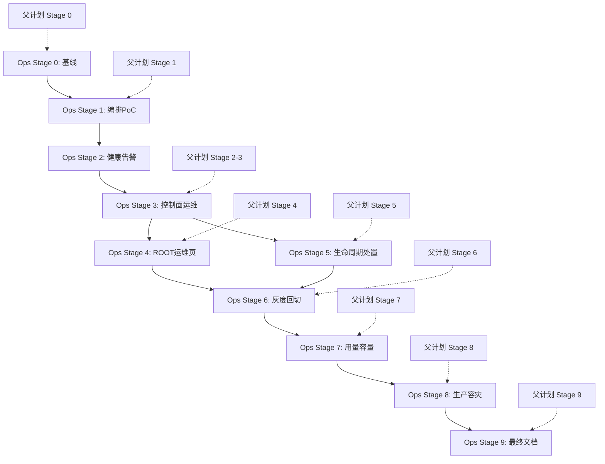

# ProjectHub AI 中转平台服务运维计划

> 父计划：[AI 中转平台长期建设](/Users/vastgui/Desktop/project-manager/.cursor/plans/ai中转平台长期建设_a376dc39.plan.md)  
> 初始日期：2026-07-23  
> 运维目标：同一台服务器上的所有服务都能被统一发现、启动、停止、重启、检查、告警和恢复  
> 当前状态：运维方案已建立，等待从运维 Stage 0 开始

---

## 0. 计划定位与核心原则

这份文件不是另外一套业务功能计划，而是 AI 中转长期建设的运维伴随计划。父计划每推进一个阶段，都必须在本文件完成对应的运维能力，否则该阶段只能算“开发完成”，不能算“可上线完成”。

### 0.1 首版目标

- 单台服务器可运行 ProjectHub、AI Gateway、Provider Adapter、Embedding、Worker、Redis 和 PostgreSQL。
- 不需要 Kubernetes，不引入多节点编排复杂度。
- ProjectHub 和现有宿主机服务优先使用 systemd。
- AI Gateway 及其 Adapter 使用 Docker Compose 统一编排。
- Caddy/Nginx/Traefik 作为唯一对外入口，内部端口不直接暴露。
- Uptime Kuma 作为首版外部可视化告警；Prometheus/Grafana 后置到指标复杂度确实出现时。
- 任何服务故障都能在一个命令或一个页面内定位，不依赖手动猜 PID。
- 所有关键服务有明确的 `healthcheck`、日志位置、重启策略、依赖关系和回滚方式。

### 0.2 不做的事情

- 首版不上 Kubernetes、Nomad 或 Docker Swarm。
- 不把 LiteLLM、CLIProxyAPI、cursor-api-proxy 的主进程嵌入 Next.js。
- 不把 OAuth/Cursor/Provider Secret 写进 ProjectHub 数据库、Git、普通日志或浏览器。
- 不把 Uptime Kuma 当作业务审计系统。
- 不把“端口监听”当作完整可用性证明。
- 不在没有备份恢复演练的情况下宣称已完成生产灾备。

### 0.3 运维质量门

每个可上线 Stage 必须同时满足：

1. 服务清单已更新。
2. 启动/停止/重启命令已记录。
3. 存活和就绪检查已实现。
4. 日志有统一查看方式和轮转策略。
5. 失败会自动恢复或明确告警。
6. 有回滚和人工接管步骤。
7. Secret 不会出现在日志、响应和仓库。
8. 父计划的功能验收和本计划的运维验收都通过。

---

## 1. 目标部署拓扑

### 1.1 单机服务清单

```text
服务器
├── systemd / systemd --user
│   ├── project-manager.service       # Next.js，3003
│   ├── project-worker.service        # IndexJob/后台 Worker
│   ├── embedding-api.service         # FastAPI + BGE-M3，5000
│   └── ai-gateway-stack.service      # 拉起/停止 Docker Compose
│
├── 宿主机或受控数据库服务
│   └── postgresql                   # 5432，保留 community + pm schema
│
└── Docker Compose: ai-gateway
    ├── caddy                         # 对外 80/443
    ├── litellm                       # 内部 4000
    ├── redis                         # 内部 6379
    ├── cliproxyapi                   # 内部 8317
    ├── cursor-api-proxy              # 内部 8765
    └── uptime-kuma                   # 监控界面，建议仅内网
```

### 1.2 端口暴露规则

| 端口 | 服务 | 默认暴露 | 规则 |
|---:|---|---|---|
| 80/443 | Caddy | 是 | 唯一对外 HTTP/HTTPS 入口 |
| 3003 | ProjectHub | 内网/反向代理 | 生产建议只允许本机或 Caddy 访问 |
| 4000 | LiteLLM | 否 | 仅 Caddy、ProjectHub、Compose 私网访问 |
| 5000 | Embedding | 内网 | 仅 ProjectHub/Worker 访问 |
| 5432 | PostgreSQL | 按现有需求 | 不对公网开放；局域网访问需白名单 |
| 6379 | Redis | 否 | 不允许公网和普通局域网访问 |
| 8317 | CLIProxyAPI | 否 | 仅 LiteLLM 私网访问 |
| 8765 | cursor-api-proxy | 否 | 仅 LiteLLM 私网访问 |
| 3001 | Uptime Kuma | 否 | 仅 SSH 隧道或内网管理入口 |

### 1.3 数据边界

| 数据 | 所属 | 备份 | 禁止事项 |
|---|---|---|---|
| ProjectHub 业务表 | PostgreSQL `community.pm` | 必须备份 | 不改 community 公共表语义 |
| LiteLLM 元数据 | 独立 DB/schema 或独立数据库 | 必须备份 | 不与 ProjectHub `pm` 表混用 |
| Redis | 临时状态 | 不作为唯一备份 | 不存唯一业务授权 |
| Embedding 向量/索引 | 现有数据存储 | 按现有备份策略 | 恢复时必须验证维度 |
| OAuth refresh token | CLIProxyAPI Secret volume | 加密备份或不备份 | 不上传普通仓库/普通日志 |
| Cursor 登录态 | cursor Adapter Secret volume | 加密备份或重新登录 | 不进入 ProjectHub 数据库 |
| Uptime Kuma 配置 | 独立 volume | 可选备份 | 不包含真实 Provider Secret |

---

## 2. 现有基线与迁移原则

### 2.1 当前已存在的运维方式

当前项目文档已经约定：

- ProjectHub 生产端口为 `3003`。
- PostgreSQL 使用 `community` 库和 `pm` schema。
- `AUTH_URL` / `NEXTAUTH_URL` 不应设置，保留 `AUTH_TRUST_HOST=true`。
- ProjectHub 可使用用户级 systemd 常驻。
- Embedding 服务端口为 `5000`，已有 `embedding-api.service` 约定。
- `scripts/deploy.sh` 当前执行 `git fetch/pull → npm install → prisma generate → npm run build → 杀 3003 端口 → nohup npm run start`。

### 2.2 当前问题

- `deploy.sh` 通过端口杀进程，无法表达服务身份。
- `nohup` 启动不提供完整的守护、状态和依赖管理。
- 启动检查主要看端口，不能证明数据库、登录、Embedding 或核心 API 正常。
- Embedding 文档仍保留手动 `nohup` 启动和 PID 排查方式。
- AI Gateway 服务尚未形成统一 Compose、日志、健康检查和外部告警体系。
- 当前有项目级部署日志，但没有全局服务状态视图。

### 2.3 迁移原则

1. 先建立观察能力，再切换进程管理。
2. 一次只迁移一类服务。
3. 迁移期间保留旧启动方式作为短期回退，但禁止两套方式同时自动拉起同一端口。
4. 先 `npm run build`，再重启 ProjectHub。
5. 先验证健康，再标记 Stage 完成。
6. 不因运维升级顺手修改业务逻辑。
7. 每次变更记录服务版本、配置版本、执行人、时间、结果和回滚动作。

---

## 3. 服务生命周期标准

### 3.1 统一状态

每个服务都使用以下状态语义：

```text
DISABLED  未启用
STARTING  正在启动
HEALTHY   进程和业务探针均正常
DEGRADED  进程正常但依赖或部分 Provider 异常
DOWN      进程停止或探针持续失败
MAINTENANCE 计划内维护
```

Docker 的 `Up` 只能代表容器进程存在；`healthy` 才能代表探针通过；ProjectHub ROOT 页面还应展示 Provider 级别的 `DEGRADED`。

### 3.2 每个服务必须声明

- 服务名称和唯一 ID。
- 所属编排器：systemd 或 Compose。
- 监听端口。
- 依赖服务。
- 启动命令。
- 停止/重启命令。
- 存活探针。
- 就绪探针。
- 日志查看命令。
- 日志保留周期。
- 自动重启策略。
- 最大重启次数和退避。
- Secret 引用。
- 数据目录和备份策略。
- 回滚版本。
- 负责人和告警接收人。

### 3.3 systemd 服务规则

ProjectHub、Worker、Embedding 和 PostgreSQL 由 systemd 管理时，应具备：

- `Restart=on-failure` 或明确的 `Restart=always`。
- `RestartSec` 避免快速重启风暴。
- `StartLimitIntervalSec` 和 `StartLimitBurst`。
- `WorkingDirectory` 固定。
- `EnvironmentFile` 权限为 `0600`。
- `NoNewPrivileges=true`，能启用时启用。
- `StandardOutput=journal`，不再依赖无轮转的 `/tmp/*.log`。
- `ExecStartPre` 执行必要的配置检查。
- `TimeoutStartSec` 覆盖 Embedding 模型冷启动时间。

### 3.4 Compose 服务规则

LiteLLM、Redis、CLIProxyAPI、cursor-api-proxy、Caddy 和 Uptime Kuma 应具备：

- 镜像 tag 和 digest 固定，禁止生产使用 `latest`。
- `restart: unless-stopped`。
- `healthcheck`。
- 日志大小和文件数限制。
- 非 root 用户运行（上游支持时）。
- 只挂载必要目录。
- Adapter 使用只读 ProjectHub/无 workspace 权限。
- Admin 端口只绑定 Compose 私网。
- Secret 使用 `env_file`、Docker secret 或受控挂载，不写入镜像。

---

## 4. 运维目录与文件规划

建议在项目中新增以下运维目录；具体实现时遵守项目 FSD 规则，运维配置不放入 `features/`：

```text
infra/
├── ai-gateway/
│   ├── docker-compose.yml
│   ├── docker-compose.monitoring.yml
│   ├── .env.example
│   ├── litellm/config.yaml.example
│   ├── adapters/*.env.example
│   ├── caddy/Caddyfile.example
│   ├── healthchecks/
│   ├── scripts/
│   │   ├── check-stack.sh
│   │   ├── smoke-test.sh
│   │   ├── backup-volumes.sh
│   │   └── rotate-secrets.sh
│   └── README.md
├── systemd/
│   ├── project-manager.service.example
│   ├── project-worker.service.example
│   ├── embedding-api.service.example
│   └── ai-gateway-stack.service.example
└── monitoring/
    ├── uptime-kuma-monitors.md
    ├── alert-routing.md
    └── dashboards/

docs/operations/
├── ai-gateway-runbook.md
├── ai-gateway-incident-response.md
├── ai-gateway-backup-restore.md
├── ai-gateway-secret-rotation.md
└── ai-gateway-release.md
```

说明：`.env.example` 可以入仓库，真实 `.env`、OAuth volume 和 Cursor 登录态不能入仓库。当前项目如果已有其他目录约定，以实际现状为准，不为了运维计划提前创建大量空目录。

---

## 5. 健康检查合同

### 5.1 三层探针

每个服务至少区分三层：

1. **Process/Liveness**：进程是否还活着。
2. **Readiness**：服务是否可以接受请求。
3. **Dependency/Business**：关键依赖和最小业务流程是否正常。

### 5.2 服务探针矩阵

| 服务 | Liveness | Readiness | Dependency/Business |
|---|---|---|---|
| ProjectHub | `GET /api/health/live` | `GET /api/health/ready` | DB、Auth 配置、Embedding、Gateway 可达 |
| Worker | systemd 状态 + heartbeat | 最近 heartbeat 未超时 | 能领取/完成一个安全测试任务 |
| PostgreSQL | `pg_isready` | 登录指定 DB/schema | 可执行只读查询 |
| Embedding | `GET /health` | `GET /dimension` | `/embed` 最小测试或内部 smoke |
| LiteLLM | `/health/liveliness` | `/health/readiness` 或 `/v1/models` | 指定低成本模型 smoke |
| Redis | `redis-cli ping` | TCP + PING | 读写临时测试键 |
| CLIProxyAPI | `/v1/models` | `/v1/models` + 配置加载 | 授权账号模型探测 |
| cursor-api-proxy | `/v1/models` | `/v1/models` | chat-only 低风险请求 |
| Caddy | HTTP/HTTPS | 证书和 upstream | 访问 ProjectHub/Gateway 入口 |
| Uptime Kuma | HTTP | Web 服务 | 告警发送测试 |

### 5.3 健康检查要求

- 不把真实 Provider 大模型请求放在每 30 秒探针中，避免产生费用和污染用量。
- Provider smoke 使用低成本、低输出、可配置的专用模型或人工触发。
- 探针响应不得包含 Secret、上游完整 URL、完整模型凭据或内部堆栈。
- 健康接口区分“服务活着”和“Provider 可用”。
- 依赖异常时返回 `DEGRADED`，不要简单伪装成 200 healthy。
- 启动阶段支持冷启动，Embedding 模型加载不能因固定短超时被误判为永久失败。

---

## 6. 日志、指标与告警

### 6.1 日志标准

默认记录：

- 时间。
- 服务名和版本。
- request ID/trace ID。
- 用户/项目内部 ID（允许时）。
- Key prefix，不记录完整 Key。
- 模型、Provider。
- 状态码、错误分类、延迟。
- 输入/输出 Token 或 usage 来源。

禁止记录：

- `Authorization`。
- 完整 API Key、LiteLLM Master Key。
- OAuth refresh token。
- Cursor Cookie 或登录态。
- 完整 prompt/response，除非显式脱敏并仅在临时 Debug 窗口启用。
- 上传文件正文和 RAG 私密内容。

### 6.2 日志入口

```bash
# systemd
journalctl --user -u project-manager.service -f
journalctl --user -u project-worker.service -f
journalctl --user -u embedding-api.service -f

# Compose
cd /opt/projecthub/ai-gateway
docker compose logs --since=30m litellm
docker compose logs -f cursor-api-proxy
```

日志至少保留 7 天；生产按磁盘容量设置轮转，Docker `json-file` 必须配置 `max-size` 和 `max-file`，systemd journal 必须配置磁盘上限。

### 6.3 首版指标

- 服务可用率。
- HTTP 2xx/4xx/5xx。
- Gateway P50/P95。
- 首 Token 延迟。
- 429 次数。
- Provider Fallback 次数。
- Adapter 健康状态。
- ProjectHub/Worker 重启次数。
- Outbox pending/failed 数量。
- Key 创建、更新、吊销失败率。
- 用量 webhook 延迟和重复率。
- 磁盘、内存、CPU、数据库连接池。

### 6.4 告警分级

| 级别 | 例子 | 处理时限 |
|---|---|---|
| P0 | 服务器不可达、Secret 泄漏、数据库损坏 | 立即人工接管 |
| P1 | ProjectHub/Gateway 持续不可用、所有 Provider down | 15 分钟内处理 |
| P2 | 单 Adapter down、Key 吊销积压、Worker 停止 | 1 小时内处理 |
| P3 | P95 上升、磁盘超过 70%、单次重试失败 | 工作日处理 |

### 6.5 Uptime Kuma 监控

首版用 Uptime Kuma 做独立外部告警，不让 ProjectHub 自己监控自己。建议：

- 30 秒检查间隔。
- 连续 3 次失败告警。
- 90 秒后通知。
- 恢复时发送恢复通知。
- 监控 ProjectHub、Gateway、Embedding、Adapter、数据库 TCP 和 Caddy 入口。
- Uptime Kuma 本身最好部署在不同于被监控主进程的容器；条件允许时放在另一台设备。

ProjectHub ROOT 页面可以展示业务状态，但不是唯一告警来源。

---

## 7. 备份、恢复与数据保留

### 7.1 备份对象

必须明确备份：

- ProjectHub `community.pm` 数据。
- LiteLLM 元数据数据库。
- 配置文件和版本清单。
- Caddy 配置和证书状态。
- Uptime Kuma 配置。
- AI Gateway Compose 文件。

谨慎处理：

- CLIProxyAPI OAuth volume。
- cursor-api-proxy 登录态 volume。
- Provider Cookie 和 refresh token。

这些敏感数据只能加密备份，或者明确选择丢弃后重新登录。不能随普通数据库备份一起进入共享目录。

### 7.2 备份策略

| 对象 | 频率 | 保留 | 验证 |
|---|---|---|---|
| ProjectHub DB | 每日全量 + 关键变更前 | 7/30 天 | 每月恢复到隔离 DB |
| LiteLLM DB | 每日 | 7/30 天 | 能启动 Gateway 并读取元数据 |
| Compose/config | 每次变更 | Git 历史 | 校验 Secret 引用完整 |
| Secret volume | 轮换前 + 每周 | 加密 | 每季度恢复演练 |
| Uptime Kuma | 每周/变更前 | 30 天 | 可恢复监控配置 |

### 7.3 恢复目标

首版目标需要在 Stage 8 冻结：

- ProjectHub RPO：不超过 24 小时，关键变更前必须即时备份。
- ProjectHub RTO：不超过 2 小时。
- Gateway 元数据 RPO：不超过 24 小时。
- Redis 丢失：允许临时限流状态丢失，不允许业务授权数据丢失。
- Adapter OAuth 丢失：允许重新登录，但必须在 runbook 明确步骤。

### 7.4 恢复验收

不能只验证备份文件存在，必须实际：

1. 创建隔离数据库或临时服务器。
2. 恢复 ProjectHub 数据。
3. 恢复 LiteLLM 元数据。
4. 启动服务。
5. 执行健康检查和只读业务 smoke。
6. 验证 Key、模型目录、同步任务和用量记录可读。
7. 记录耗时和失败原因。

---

## 8. Secret、权限与安全运维

### 8.1 Secret 分层

```text
ProjectHub secrets
├── DATABASE_URL
├── AUTH_SECRET
├── AI_GATEWAY_INTERNAL_KEY
└── EMBEDDING_API_SECRET

LiteLLM secrets
├── LiteLLM master/admin key
├── Redis password
└── Provider credentials

CLIProxyAPI secrets
└── OAuth accounts / refresh tokens

cursor-api-proxy secrets
└── Cursor login state

Caddy/Uptime Kuma
└── TLS and notification credentials
```

每层使用独立文件、独立权限和最小可读范围。ProjectHub 不读取 Adapter OAuth Secret，Adapter 不读取 ProjectHub 数据库。

### 8.2 轮换流程

1. 新建新 Secret。
2. 先在备用配置或临时容器验证。
3. 更新服务配置。
4. 重启/滚动切换服务。
5. 执行健康和真实最小请求验证。
6. 撤销旧 Secret。
7. 检查日志和失败请求。
8. 更新版本/轮换记录，不记录 Secret 内容。

### 8.3 紧急吊销

以下情况必须能在 15 分钟内完成：

- Master Key 泄漏。
- Virtual Key 被误发。
- OAuth refresh token 泄漏。
- Cursor 登录态失控。
- Provider API Key 出现在日志。

紧急动作：

- 关闭新 Key 创建。
- 禁用本地 Key。
- 远端撤销对应 Key。
- 轮换受影响 Secret。
- 检查访问日志和用量。
- 记录事件时间线。
- 通知相关用户。

---

## 9. 发布、升级与回滚

### 9.1 发布对象

分开管理以下版本：

- ProjectHub Git commit。
- ProjectHub Node/Prisma 依赖。
- LiteLLM image tag/digest。
- Adapter image/tag/commit。
- Redis/PostgreSQL 版本。
- Caddy 配置版本。
- 运维脚本和 systemd unit 版本。

任何单独升级都要记录变更原因、影响服务、健康结果和回滚版本。

### 9.2 ProjectHub 发布流程

当前 `scripts/deploy.sh` 使用端口杀进程和 `nohup` 启动。目标流程：

```text
git fetch/pull
→ npm ci
→ prisma generate
→ npm run build
→ systemctl restart project-manager
→ 等待 ready probe
→ 执行首页/API/数据库 smoke
→ 成功后记录 release
→ 失败则恢复上一构建并 restart
```

迁移完成前，不允许同时让旧脚本和 systemd 自动启动 ProjectHub。

### 9.3 AI Gateway 发布流程

```text
备份配置/元数据
→ 固定新镜像 tag + digest
→ 在 PoC 或维护窗口拉取镜像
→ docker compose config 校验
→ 先更新非核心 Adapter
→ healthcheck
→ LiteLLM 升级
→ models/health/smoke
→ 观察 15-30 分钟
→ 关闭旧版本或保留可回滚镜像
```

不允许无测试直接执行 `docker compose pull && up -d` 覆盖生产。

### 9.4 回滚流程

ProjectHub：

1. 停止自动部署。
2. 选择上一成功 commit/build。
3. 恢复兼容环境变量。
4. `npm run build`。
5. 重启 systemd 服务。
6. 验证 ready、登录和 AI 入口。
7. 标记当前版本和失败原因。

Gateway：

1. 固定 Compose 文件恢复上一版本。
2. 恢复 LiteLLM/Adapter 配置。
3. `docker compose up -d`。
4. 验证 `/v1/models`、低风险 smoke 和健康页。
5. 必要时 `AI_PROVIDER_MODE=agnes` 回切 ProjectHub 内置 AI。

数据库：

- 首版只允许向前兼容新增结构。
- 禁止为了回滚业务版本直接删除新表。
- Schema 不兼容变更必须先设计 expand/contract 迁移。

---

## 10. 故障排查与事件响应

### 10.1 统一入口

```bash
# 查看宿主机异常服务
systemctl --failed
systemctl --user --failed

# 查看 AI Gateway 栈
cd /opt/projecthub/ai-gateway
docker compose ps
docker compose config

# 查看 systemd 日志
journalctl --user -u project-manager.service --since "30 minutes ago"
journalctl --user -u project-worker.service --since "30 minutes ago"
journalctl --user -u embedding-api.service --since "30 minutes ago"

# 查看 Compose 日志
docker compose logs --since=30m litellm
docker compose logs --since=30m cliproxyapi
docker compose logs --since=30m cursor-api-proxy

# 查看资源
free -h
df -h
docker stats --no-stream
```

### 10.2 标准排查顺序

1. 先看外部监控：是单服务还是整机不可达。
2. 看 `systemctl --failed` 和 `docker compose ps`。
3. 看最近 30 分钟日志，不要先反复重启覆盖现场。
4. 看 CPU、内存、磁盘、连接数。
5. 看依赖链：ProjectHub → DB/Embedding/Gateway；LiteLLM → Redis/Adapter/Provider。
6. 执行对应 liveness/readiness/dependency probe。
7. 采取最小影响恢复动作。
8. 恢复后保留日志、时间线和根因。

### 10.3 常见故障动作

| 故障 | 先做什么 | 可接受恢复动作 |
|---|---|---|
| ProjectHub 挂 | 看 systemd/journal | restart ProjectHub；失败则回滚构建 |
| Worker 挂 | 看 heartbeat/日志 | 单独 restart Worker，不先重启网站 |
| Embedding 挂 | 看模型加载/内存 | restart；确认 `/health` 和 `/dimension` |
| LiteLLM 挂 | 看容器状态/Redis/配置 | restart LiteLLM；必要时回切 Agnes |
| 单 Adapter 挂 | 标记 Provider degraded | restart Adapter；禁用该模型/路由 |
| Redis 挂 | 看内存/磁盘/容器 | restart Redis；确认不丢业务授权 |
| PostgreSQL 挂 | 先保护数据 | 检查磁盘/连接/服务状态；禁止盲目删除数据目录 |
| Key 吊销积压 | 查 SyncJob | 暂停新 Key；重试或人工撤销 |
| 磁盘满 | 查日志/volume/备份 | 先保留现场，轮转或清理明确安全对象 |

### 10.4 事件记录

每个 P0/P1 事件记录：

- 开始时间、发现来源。
- 受影响服务、用户和项目。
- 当前版本和配置版本。
- 关键日志/指标。
- 执行过的命令和结果。
- 恢复时间。
- 根因。
- 防止再次发生的行动项。

---

## 11. 与父计划 Stage 同步矩阵

父计划不是只同步开发文件；每个 Stage 必须完成对应运维项。

| 父计划 Stage | 业务目标 | 必须同步的运维交付物 | 运维完成门 |
|---|---|---|---|
| Stage 0 | ADR、版本、协议和许可证冻结 | 服务清单、端口表、Secret/数据边界、RTO/RPO 初稿、风险清单 | 没有未定义的服务负责人、端口和恢复方式 |
| Stage 1 | LiteLLM/Adapter PoC | Compose、systemd 栈服务、healthcheck、日志、Uptime Kuma、smoke 脚本 | 任一服务挂掉能发现，能单独重启并验证 |
| Stage 2 | ProjectHub Schema 和 Key/Usage 模型 | DB 备份、迁移前备份、Schema 变更回滚说明、连接池和磁盘监控 | 新增数据可备份恢复，不能影响现有 `pm` 业务 |
| Stage 3 | Gateway Port、Adapter、Outbox 和 API | Gateway Admin 隔离、Worker 守护、SyncJob 告警、幂等重试、Key 紧急吊销 | Gateway/Worker/DB 任一异常有告警和人工恢复步骤 |
| Stage 4 | 个人/项目/ROOT 管理 UI | ROOT 健康面板、操作审计、状态文案、故障排查入口 | UI 状态与真实探针一致，不泄露 Secret |
| Stage 5 | 成员撤权和 Key 生命周期 | 封禁/移除成员自动撤权告警、远端吊销积压、Secret 轮换 runbook | 撤权后本地立即失效，远端失败可重试并告警 |
| Stage 6 | Agnes → Gateway 灰度切换 | 发布检查、灰度指标、自动/人工回切、变更窗口、回滚演练 | 能在不改代码情况下回切 Agnes |
| Stage 7 | 用量、配额和审计 | 指标、容量阈值、用量 webhook 监控、成本/额度告警 | 重复、乱序、缺失 usage 可发现并处理 |
| Stage 8 | 生产安全和容灾 | 备份恢复、权限收敛、日志轮转、事件响应、容灾演练 | 恢复时间和结果有实测记录 |
| Stage 9 | Review、复现和迁移基线 | 完整 Runbook、值班手册、版本清单、最终运维 Review | 新人能按文档完成启动、排障、回滚 |

### 11.1 同步规则

- 父计划每个 Stage 的 `status` 变为 `completed` 前，本计划对应 todo 必须先完成。
- 父计划的进度日志中记录本计划文件和运维验收结果。
- 本计划新增运维风险时，同步追加父计划风险清单。
- 任何运维实现变更不能静默改写父计划的架构决策。
- Stage 1 以后禁止添加“无健康检查、无日志、无回滚”的生产服务。

---

## 12. 分阶段实施计划

### 运维 Stage 0：基线盘点

**依赖**：父计划 Stage 0。  
**目标**：知道服务器上到底有什么服务、数据、端口、Secret、启动方式和恢复手段。

交付物：

- `docs/operations/ai-gateway-service-inventory.md`。
- 当前服务、端口、用户、目录、systemd unit、Docker 容器清单。
- ProjectHub、Worker、Embedding、PostgreSQL 的当前启动方式。
- AI Gateway 服务的目标清单，即使尚未部署也要标记 `planned`。
- Secret inventory 只记录名称、Owner、存储位置，不记录值。
- 备份现状、恢复时间和磁盘容量基线。
- 服务依赖图和初步 RTO/RPO。

验收：

- `systemctl --failed`、`systemctl --user --failed`、`docker ps -a`、端口清单已记录。
- 每个服务有负责人、路径、命令、日志和回滚说明。
- 未发现生产 Secret 被提交到 Git。

回滚：无运行时修改。

### 运维 Stage 1：编排 PoC

**依赖**：父计划 Stage 1。  
**目标**：先把 AI Gateway 服务放进一个可重复启动的栈。

交付物：

- `infra/ai-gateway/docker-compose.yml`。
- Compose `.env.example` 和固定版本清单。
- `ai-gateway-stack.service` systemd unit。
- Caddy 内部路由配置。
- `restart: unless-stopped`、资源限制、日志轮转和 healthcheck。
- `check-stack.sh`、`smoke-test.sh`。
- Uptime Kuma 初始监控清单。

验收：

- 服务器重启后 Compose 栈可恢复。
- 任意单个容器停止后能被发现并单独重启。
- LiteLLM、Redis、Adapter 端口不对公网开放。
- Caddy → LiteLLM → Adapter 链路 smoke 通过。
- ProjectHub 仍可回切 Agnes，不受 PoC 影响。

回滚：停止 Compose 栈，保留 ProjectHub 原有服务。

### 运维 Stage 2：健康、日志与告警

**依赖**：运维 Stage 1。  
**目标**：解决“服务挂了但没人知道”。

交付物：

- ProjectHub `/api/health/live`、`/api/health/ready` 设计或实现。
- Worker heartbeat 检查。
- LiteLLM、Adapter、Redis、Embedding 探针。
- systemd journal 和 Docker 日志轮转设置。
- Uptime Kuma 监控项、通知渠道和失败阈值。
- P0/P1/P2/P3 告警规则。
- `docs/operations/ai-gateway-incident-response.md` 初稿。

验收：

- 人工停止 ProjectHub、LiteLLM、Adapter、Worker 各一次。
- 监控在目标时间内告警。
- 恢复服务后收到恢复通知。
- 健康接口不泄露 Secret。
- 端口监听与业务 ready 状态能区分。

回滚：关闭新增监控，不影响服务本身；健康接口可保留但不作为流量门禁。

### 运维 Stage 3：控制面运维

**依赖**：父计划 Stage 2-3。  
**目标**：把 Gateway Admin API、Key 同步和后台 Worker 纳入可运维体系。

交付物：

- Gateway Admin API 仅私网访问的规则。
- SyncJob Worker 独立 systemd 服务或明确的执行器。
- pending/failed/retry 指标和告警。
- Key 创建、更新、吊销的操作审计。
- Master Key 和 ProjectHub Internal Key 的轮换方案。
- 远端吊销失败的人工处理 Runbook。

验收：

- Gateway 挂掉时不会无限重试和产生重启风暴。
- Key 吊销失败可被发现、重试和人工处理。
- Admin Key 不进入浏览器和日志。
- DB 恢复后 SyncJob 状态可继续处理。

### 运维 Stage 4：ROOT 运维面板

**依赖**：父计划 Stage 4。  
**目标**：让 ROOT 在 ProjectHub 内看到业务层状态，但不替代外部监控。

交付物：

- Gateway/Provider/Adapter 状态卡。
- 最近健康时间、版本、错误摘要。
- SyncJob 积压和重试入口。
- 最近部署版本和回滚版本。
- 操作审计入口。
- 状态降级文案和维护态。

验收：

- 页面状态来自真实探针或同步数据。
- 普通用户无法访问 ROOT 运维数据。
- 页面不显示 Secret、Cookie、完整 Key。
- Uptime Kuma 与 ROOT 页面状态差异可解释。

### 运维 Stage 5：生命周期与安全处置

**依赖**：父计划 Stage 5。  
**目标**：让成员撤权、封禁、Key 吊销和凭据轮换形成闭环。

交付物：

- 成员移除、角色降级、封禁、项目删除的运维事件。
- Key 吊销积压告警。
- 紧急吊销脚本或管理命令。
- Provider OAuth/Cursor 登录态重新认证流程。
- Secret 轮换记录模板。

验收：

- 成员移除后本地 Key 立即不可用。
- 远端 revoke 失败时告警且不恢复为 active。
- 误发 Key 可在 15 分钟内吊销。
- Master Key 泄漏时有明确的轮换和验证步骤。

### 运维 Stage 6：灰度发布与回切

**依赖**：父计划 Stage 6。  
**目标**：让 Agnes/Gateway 切换可以控速、观察和回退。

交付物：

- 发布前 preflight：版本、配置、DB、依赖、磁盘、备份。
- 灰度阶段的监控指标和阈值。
- 变更窗口和发布记录模板。
- Agnes 回切命令/环境变量说明。
- Gateway 上一版本镜像和 ProjectHub 上一成功构建保留策略。

验收：

- ROOT → 10% → 单项目 → 全内部每一步均可暂停。
- 发生错误时能切回 Agnes。
- 回切后 SSE、RAG、Tool Calling 和消息落库恢复。
- 发布失败不覆盖故障现场日志。

### 运维 Stage 7：用量和容量

**依赖**：父计划 Stage 7。  
**目标**：用量不仅能展示，还能指导容量和故障预警。

交付物：

- Gateway 请求率、P95、首 Token、429、Fallback 指标。
- Provider 和 Adapter 健康趋势。
- DB 连接池、Redis 内存、Docker volume、磁盘容量监控。
- 80%/100% 内部额度、同步任务积压、磁盘 70%/85% 告警。
- usage webhook 延迟、重复和失败指标。

验收：

- 能区分 Gateway 故障、Provider 故障和 ProjectHub 故障。
- 用量重复不会被误报为真实增长。
- 容量阈值触发通知。
- 监控数据保留周期已确定。

### 运维 Stage 8：生产和容灾

**依赖**：父计划 Stage 8。  
**目标**：完成生产上线前的恢复能力证明。

交付物：

- `docs/operations/ai-gateway-backup-restore.md`。
- `docs/operations/ai-gateway-secret-rotation.md`。
- 备份脚本和备份校验脚本。
- ProjectHub DB、LiteLLM DB、配置、监控配置恢复记录。
- 故障演练报告。
- 生产上线 Checklist。

必做演练：

- ProjectHub 进程崩溃。
- Worker 停止。
- LiteLLM 容器退出。
- 单 Adapter 下线。
- Redis 丢失。
- Provider Token 过期。
- ProjectHub DB 恢复。
- LiteLLM 配置回滚。
- Master Key 紧急轮换。
- 磁盘接近满载。

验收：

- RTO/RPO 是实测值，不是估算值。
- 备份能恢复到隔离环境。
- 灰度回切通过。
- 日志和 Secret 扫描通过。
- 发布前 `npm run lint`、`npm run test`、`npm run build` 及 Gateway 契约测试通过。

### 运维 Stage 9：文档和最终 Review

**依赖**：父计划 Stage 9。  
**目标**：让其他维护者不依赖当前开发者记忆即可运维。

交付物：

- 完整 `ai-gateway-runbook.md`。
- 故障事件响应文档。
- 服务库存和端口表。
- 版本和 License 清单。
- 备份恢复记录。
- Secret 轮换记录。
- 值班/通知联系人。
- 运维 Review 报告。
- 与父计划复现文档互相引用。

验收：

- 新维护者按文档完成启动、状态检查、单服务重启和回滚。
- Review 的 Critical 问题全部修复。
- 父计划和本计划进度状态一致。

---

## 13. 依赖图与并行边界



可并行内容：

- 父计划 Stage 0 文档冻结时，可以并行做服务器基线盘点。
- 父计划 Stage 1 PoC 和运维 Compose/healthcheck 可以并行，但必须在 PoC 验收前合并。
- 父计划 Stage 4 UI 和 Ops Stage 4 ROOT 状态页可并行，接口合同必须稳定。
- 父计划 Stage 7 用量开发和容量指标开发可并行，但共享字段必须先冻结。

不可并行内容：

- 没有 healthcheck 不能进入生产流量。
- 没有回滚方案不能做 Agnes → Gateway 灰度。
- 没有备份恢复演练不能宣称 Stage 8 生产完成。
- 同一 systemd unit、Compose 文件或 Secret 配置不得由两个执行者同时修改。

---

## 14. 进度同步规则

本文件与父计划必须双向同步，但父计划仍是业务架构的主索引。

### 14.1 状态同步

- 父计划 Stage 进入 `in_progress` 时，本计划对应 Ops Stage 进入 `in_progress`。
- 父计划 Stage 不能标记 `completed`，直到本计划对应运维门完成。
- 任何时刻每份计划最多一个主 Stage 为 `in_progress`；PoC 文档可并行但不能产生两个生产变更窗口。
- 阶段失败时保留 `in_progress`，记录失败原因，不伪造完成。

### 14.2 双方进度日志

父计划和本计划都追加同一格式：

```text
YYYY-MM-DD | Parent Stage / Ops Stage | 状态 | 产物/命令 | 验收/风险/下一步
```

示例：

```text
2026-07-23 | Parent Stage 1 / Ops Stage 1 | completed | infra/ai-gateway/docker-compose.yml; docker compose config; smoke-test.sh | Compose、健康检查和回滚验证通过；下一步接入外部告警
```

### 14.3 每阶段汇报模板

```text
阶段：Parent Stage X / Ops Stage Y
改动：
验证：
Review：
告警：
回滚：
剩余风险：
是否允许进入下一阶段：
```

### 14.4 版本记录

每次 Stage 记录：

- ProjectHub commit。
- Compose 文件版本。
- 镜像 tag/digest。
- Adapter commit/tag。
- systemd unit 版本。
- 数据库 schema 版本。
- 配置变更摘要。
- 执行时间和执行人。

---

## 15. 首版运维验收清单

### 服务编排

- [ ] ProjectHub 不再依赖 `nohup` 作为生产守护方式。
- [ ] Worker 有独立服务和 heartbeat。
- [ ] Embedding 的文档与实际 systemd 方式一致。
- [ ] AI Gateway 使用固定版本 Compose。
- [ ] 容器使用 restart policy 和 healthcheck。
- [ ] 服务器重启后服务按依赖恢复。

### 观测与告警

- [ ] ProjectHub、Gateway、Embedding、Worker、DB、Redis、Adapter 可查状态。
- [ ] Uptime Kuma 能检测核心入口。
- [ ] 服务停止会告警，恢复会通知。
- [ ] 日志统一、可过滤、有限大小。
- [ ] 日志无完整 Key、Token、Cookie 和业务正文。

### 安全与恢复

- [ ] Admin API、Redis、Adapter 内部端口不公网暴露。
- [ ] ProjectHub、Gateway、Adapter Secret 分层。
- [ ] DB 和配置可恢复。
- [ ] Key 紧急吊销可在 15 分钟内完成。
- [ ] Agnes 回切已演练。
- [ ] RTO/RPO 有实测记录。

### 发布与协作

- [ ] 发布前有 preflight。
- [ ] 生产镜像不使用 `latest`。
- [ ] 每个服务有回滚版本。
- [ ] 父计划与本计划状态一致。
- [ ] Review Critical 问题已修复。

---

## 16. 当前进度

| 日期 | 父计划 | 运维阶段 | 状态 | 产物/命令 | 风险/下一步 |
|---|---|---|---|---|---|
| 2026-07-23 | 规划 | Ops 规划 | completed | 建立服务清单、systemd + Compose + Uptime Kuma 运维路线；新增本计划 | 等待进入 Ops Stage 0，先完成服务器与现有服务盘点 |

---

## 17. 长期演进路线

```text
当前：systemd + 手动/脚本部署
  ↓
阶段一：systemd 统一托管 ProjectHub/Worker/Embedding
  ↓
阶段二：Docker Compose 托管 AI Gateway/Adapter/监控
  ↓
阶段三：健康检查 + Uptime Kuma + 日志轮转
  ↓
阶段四：ROOT 运维面板 + 用量/同步告警
  ↓
阶段五：备份恢复演练 + Secret Manager
  ↓
规模明显增长后：Prometheus/Grafana、CI 构建、镜像发布
  ↓
多节点需求出现后：再评估 Kubernetes/Bifrost/多区域
```

原则：先把“知道服务是否正常”和“能安全恢复”做好，再增加指标平台和编排复杂度。
