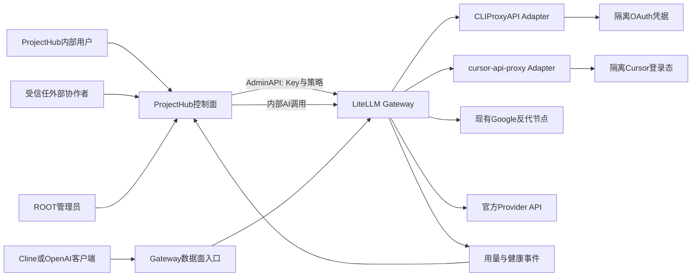
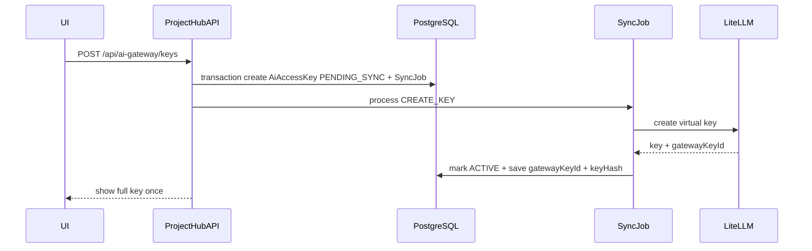
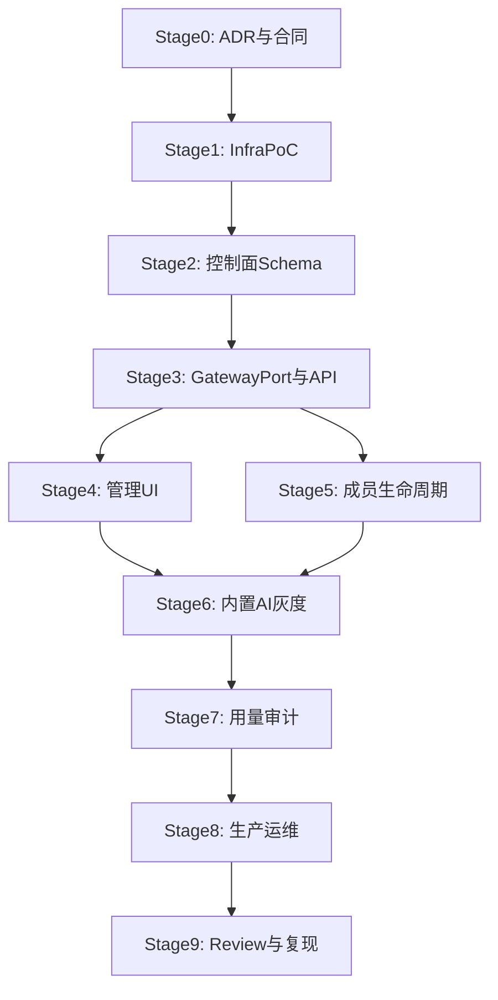

# ProjectHub AI 中转平台长期建设计划

> 初始日期：2026-07-23  
> 首版方向：LiteLLM 作为统一 AI Gateway，ProjectHub 作为控制面  
> 服务范围：内部成员 + 少量受信任外部协作者  
> 当前状态：规划完成，等待进入 Stage 0

---

## 0. 修订记录

| 日期 | 版本 | 变更 | 决策依据 |
|---|---|---|---|
| 2026-07-23 | v1 | 建立长期建设计划 | 用户确认首版使用 LiteLLM，服务内部成员与受信任外部协作者 |

---

## 1. 背景与目标

当前 ProjectHub 已具备用户、项目、成员、工单、PKM、RAG、AI 对话和 LangGraph 编排能力。现有 AI 调用集中在 [features/ai/lib/agnes-provider.ts](/Users/vastgui/Desktop/project-manager/features/ai/lib/agnes-provider.ts:1)，通过 `AGNES_API_URL` 和 `OPENAI_API_KEY` 创建 OpenAI-compatible Provider。用户希望新增一个“小型中转站”，能把已经跑通的 Google/Cursor/Claude/Codex 等反代能力纳入 ProjectHub，并与用户账号、项目成员和团队权限绑定。

本计划的目标不是把某个反代程序直接嵌入 Next.js，而是建立一个可长期演进的多层架构：

- ProjectHub 负责身份、项目、成员、策略、Key 元数据、审计和业务可见性。
- LiteLLM 负责统一 API、Virtual Key、模型白名单、配额、路由、重试、Fallback 和基础用量。
- CLIProxyAPI、cursor-api-proxy、现有 Google 反代、官方 API 作为隔离 Provider Adapter。
- OAuth refresh token、Cursor 登录态、Provider Cookie 不进入 ProjectHub 业务数据库。
- 后续如果 LiteLLM 无法满足性能、许可证或治理要求，通过 Gateway Port 替换为 Bifrost。

明确不做：公开注册、匿名 API Key、充值支付、对外售卖、精确商业计费、在 Next.js 进程内启动 Cursor CLI 或 LiteLLM、在 ProjectHub 保存上游 OAuth Token。

---

## 2. 开源项目参考与定位

| 项目 | 链接 | 定位 | 首版角色 | 主要风险 |
|---|---|---|---|---|
| LiteLLM | [GitHub](https://github.com/BerriAI/litellm) / [Gateway Overview](https://docs.litellm.ai/docs/proxy/overview) | 多 Provider AI Gateway，支持 Virtual Key、Team、预算、路由 | 首版统一 Gateway | Python 服务，版本变化快，部分治理能力需核验开源边界 |
| LiteLLM Team Budgets | [Docs](https://docs.litellm.ai/docs/proxy/team_budgets) | 团队预算与 Key 绑定参考 | ProjectHub 项目策略映射参考 | 不直接复制其用户体系 |
| LiteLLM User/Key Budgets | [Docs](https://docs.litellm.ai/docs/proxy/users) | 用户、Key、预算、限流 | ProjectHub Key 策略映射参考 | 真实成本与内部额度需区分 |
| CLIProxyAPI | [GitHub](https://github.com/router-for-me/CLIProxyAPI) / [Installation](https://router-for-me-cliproxyapi.mintlify.app/installation) | CLI/OAuth 账号转 OpenAI/Gemini/Claude/Codex 兼容 API | Provider Adapter | OAuth 与账号池安全边界，需隔离部署 |
| cursor-api-proxy | [GitHub](https://github.com/anyrobert/cursor-api-proxy) | Cursor Agent CLI 转 OpenAI/Anthropic 兼容 API | Cursor 专用 Adapter | 不等同 Cursor IDE；真实 workspace 权限必须关闭 |
| auth2api | [GitHub](https://github.com/whiteless9/auth2api) | Claude/Codex/Cursor OAuth 转 API | Cursor Responses 实验备选 | Cursor 支持实验性质，不作为核心依赖 |
| Bifrost | [GitHub](https://github.com/maximhq/bifrost) | Go 高性能 AI Gateway，Virtual Key、Team、预算 | 后续迁移候选 | Provider 覆盖与自定义适配需验证 |
| New API | [GitHub](https://github.com/QuantumNous/new-api) | 中文生态 AI API 分发与管理系统 | 管理台/渠道模型参考 | AGPLv3 与商业授权边界，不进入首版运行依赖 |
| gproxy | [GitHub](https://github.com/3151568897/gproxy) | Rust 多通道 Gateway，内置管理台和审计 | Credential Pool/审计参考 | 不引入第二套主账号系统 |

实施纪律：每个阶段开始前重新核对上游版本、License、最近 Release、已知 Breaking Changes，并在“进度日志”记录固定版本、镜像 digest 和核验日期。

---

## 3. 总体架构



### 3.1 控制面

ProjectHub 控制面职责：

- 用户登录与角色：复用现有 NextAuth、`User.role`、`bannedAt`。
- 项目成员：复用 `Project` 与 `UserOnProject`。
- Key 生命周期：申请、创建、展示一次、更新、吊销、到期、同步失败重试。
- 策略：模型白名单、RPM、TPM、日额度、月额度、Key 有效期。
- 审计：谁给谁发了 Key、谁改了额度、谁吊销、何时失败重试。
- 用量展示：用户/项目/模型/Provider/时间维度。
- 失败处理：远端吊销失败时本地先禁用，进入 outbox 重试。

### 3.2 数据面

LiteLLM 数据面职责：

- 对外暴露 OpenAI-compatible `/v1`。
- 校验 Virtual Key。
- 执行模型访问控制。
- 执行 RPM/TPM/预算限制。
- 按模型/Provider 规则路由到 Adapter。
- Fallback、Retry、超时、健康检查。
- 产生用量、延迟、错误、Provider 归因数据。

### 3.3 Adapter 层

Provider Adapter 职责：

- CLIProxyAPI：Gemini、Claude Code、Codex、Grok 等 CLI/OAuth 账号池。
- cursor-api-proxy：Cursor Agent CLI 登录态，固定 chat-only/ask 模式。
- 现有 Google 反代：保留当前美国服务器上的反代入口，封装成 OpenAI-compatible 或 Gemini-compatible upstream。
- 官方 API：OpenAI、Anthropic、Gemini 等合法 API Key 通道。

Adapter 不承担 ProjectHub 用户、项目和团队权限，不暴露管理页面给普通用户。

---

## 4. 权限与安全模型

### 4.1 角色矩阵

| 操作 | ROOT | Project OWNER | Project MEMBER | 受信任外部协作者 | 被封禁用户 |
|---|---:|---:|---:|---:|---:|
| 注册 Gateway 节点 | 是 | 否 | 否 | 否 | 否 |
| 配置 Provider/模型 | 是 | 否 | 否 | 否 | 否 |
| 创建个人 Key | 是 | 按策略 | 按策略 | 按策略 | 否 |
| 创建项目 Key | 是 | 是 | 否 | 否 | 否 |
| 调整项目额度 | 是 | 是 | 否 | 否 | 否 |
| 查看项目用量 | 是 | 是 | 自己相关 | 自己相关 | 否 |
| 吊销成员 Key | 是 | 是 | 仅自己 | 仅自己 | 否 |
| 查看 Gateway Master Key | 否 | 否 | 否 | 否 | 否 |

### 4.2 Key 安全

- Virtual Key 创建时只显示一次。
- ProjectHub 保存：`keyPrefix`、`keyHash`、Gateway 侧 ID、策略 ID、状态。
- 不保存可逆明文 Key。
- Hash 使用强 KDF 或 HMAC-SHA256 + 服务端 Secret，不直接裸 SHA256。
- 响应、日志、审计和错误消息中只出现 prefix。
- 复制弹窗关闭后不可再次查看。

### 4.3 凭据边界

- LiteLLM Master Key 仅 ProjectHub 服务端环境可读取。
- Adapter OAuth 凭据在 Adapter 容器 volume/Secret Manager 内。
- ProjectHub 数据库不保存 Google/Cursor/Claude/Codex refresh token。
- Adapter 端口仅容器内网或私网可访问。
- 用户不能提交任意 upstream URL，防止 SSRF。

### 4.4 Cursor 特别约束

`cursor-api-proxy` 必须满足：

- `CURSOR_BRIDGE_CHAT_ONLY_WORKSPACE=true`。
- 默认 `mode=ask`，禁止 `agent`。
- 不传真实 ProjectHub workspace。
- 不启用自动 MCP 批准。
- 不向公网暴露管理端口。
- 日志不记录完整 prompt 和 response。

---

## 5. Stage 0：调研冻结、ADR 与需求合同

### 5.1 目标

冻结首版技术合同、许可证、运行边界和验收指标，避免后续实现阶段频繁更换 Gateway 或数据模型。

### 5.2 输入

- 当前 ProjectHub 架构：Next.js 16、React 19、Prisma、PostgreSQL `pm` schema。
- 当前 AI Provider：[features/ai/lib/agnes-provider.ts](/Users/vastgui/Desktop/project-manager/features/ai/lib/agnes-provider.ts:1)。
- 当前 AI SSE 入口：[app/api/ai/conversations/[id]/messages/route.ts](/Users/vastgui/Desktop/project-manager/app/api/ai/conversations/[id]/messages/route.ts:170)。
- 项目成员接口：[app/api/projects/[id]/members/route.ts](/Users/vastgui/Desktop/project-manager/app/api/projects/[id]/members/route.ts:1)。
- 开源参考链接与用户已有反代说明。

### 5.3 交付物

- `docs/architecture/ai-gateway-adr.md`
  - 为什么首版选 LiteLLM。
  - 为什么不把 CLIProxyAPI/cursor-api-proxy 嵌入 Next.js。
  - 为什么 ProjectHub 是唯一身份源。
  - Bifrost 迁移触发条件。
  - License 复核：LiteLLM、CLIProxyAPI、cursor-api-proxy、Bifrost、New API。
  - 上游账号合规说明：仅自有或授权账号，内部/受信任范围。
- `docs/operations/ai-gateway-runbook.md`
  - 节点启动/停止。
  - 健康检查。
  - 凭据轮换。
  - Key 紧急吊销。
  - Adapter 下线。
  - 回切 Agnes。
- 版本冻结表：
  - LiteLLM image/tag/digest。
  - CLIProxyAPI image/tag/digest。
  - cursor-api-proxy npm version 或 image/tag。
  - Redis/PostgreSQL/反向代理版本。
- 协议能力矩阵：
  - `/v1/models`。
  - `/v1/chat/completions`。
  - `/v1/responses`。
  - `/v1/messages`。
  - Streaming。
  - Tool Calling。
  - Images。
  - usage 来源。
  - 错误格式。
  - 超时行为。

### 5.4 决策点

| 决策 | 首版选择 | 可回退方案 |
|---|---|---|
| Gateway | LiteLLM | Bifrost |
| Cursor | cursor-api-proxy | auth2api / 不开放 Cursor |
| 多 CLI/OAuth Provider | CLIProxyAPI | gproxy / 单独 Provider 专用代理 |
| 控制面 | ProjectHub | 不可替换 |
| 外部协作者 | 必须加入 ProjectHub 项目 | 不发 Key |
| 用量 | 内部额度 + 估算标记 | 禁用成本展示 |

### 5.5 验收标准

- ADR 被用户批准。
- 开源项目 License 和版本记录完成。
- 明确首版没有公开注册和支付系统。
- 至少确认一个合法自有 Provider 账号用于 PoC。
- 关键风险写入风险清单。

### 5.6 回滚

Stage 0 不改运行系统；未批准则停止。

### 5.7 进度同步

- frontmatter `stage0-adr`：`pending → in_progress → completed`。
- 进度日志追加 ADR 文件路径、版本冻结结果和未决风险。

---

## 6. Stage 1：隔离基础设施 PoC

### 6.1 目标

在不修改 ProjectHub 业务流程的前提下，独立部署 LiteLLM 与 Adapter，验证基础协议、流式、错误、超时、Fallback 和安全边界。

### 6.2 建议目录

```text
infra/ai-gateway/
├── docker-compose.yml
├── .env.example
├── litellm/
│   ├── config.yaml
│   └── README.md
├── adapters/
│   ├── cliproxyapi.env.example
│   ├── cursor-api-proxy.env.example
│   └── google-proxy.env.example
├── reverse-proxy/
│   └── Caddyfile.example
└── tests/
    ├── smoke-chat-completions.http
    ├── smoke-responses.http
    ├── smoke-models.http
    └── load-test-notes.md
```

### 6.3 服务边界

| 服务 | 网络 | 数据 | 暴露 |
|---|---|---|---|
| LiteLLM | 私网 + 对外数据面入口 | 独立 DB/schema | `/v1/*`，Admin 仅私网 |
| Redis | 私网 | 临时状态 | 不对外 |
| CLIProxyAPI | 私网 | OAuth volume | 仅 LiteLLM 访问 |
| cursor-api-proxy | 私网 | Cursor config dirs | 仅 LiteLLM 访问 |
| 现有 Google 反代 | 私网/VPN | 现有账号 | 仅 LiteLLM 访问 |

### 6.4 PoC 测试矩阵

| 用例 | LiteLLM | CLIProxyAPI | cursor-api-proxy | Google 反代 | 验收 |
|---|---:|---:|---:|---:|---|
| `GET /v1/models` | 必测 | 必测 | 必测 | 必测 | 返回可用模型，模型别名稳定 |
| 非流式 Chat | 必测 | 必测 | 必测 | 必测 | 2xx + 可解析文本 |
| 流式 Chat | 必测 | 必测 | 必测 | 必测 | SSE delta 不重复、不丢尾包 |
| Responses | 必测 | 必测 | 视适配情况 | 必测 | 支持 `response.output_text.delta` 和 completed |
| Claude Messages | 选测 | 必测 | 必测 | 不要求 | Claude Code 兼容性通过 |
| Tool Calling | 必测 | 必测 | 选测 | 选测 | 工具 schema 和结果闭环 |
| 图片输入 | 选测 | 选测 | 不要求 | 选测 | 不支持时明确降级 |
| 429 冷却 | 必测 | 必测 | 必测 | 必测 | 不无限重试 |
| Adapter 下线 | 必测 | 必测 | 必测 | 必测 | Fallback 或明确失败 |

### 6.5 压测指标

- 小团队真实峰值估算：先以 5 并发、20 并发、50 并发阶梯验证。
- 记录：成功率、P50、P95、首 Token 延迟、平均输出长度、429、5xx、Adapter 重启恢复时间。
- 实验门槛：核心路径成功率 >= 99%，P95 不超过当前 Agnes 路径的 2 倍；若超出，记录瓶颈，不进入 Stage 2。

### 6.6 安全验收

- Adapter 日志不含 Authorization、Cookie、refresh token。
- Cursor Adapter 无权读取 ProjectHub workspace。
- Admin API 无公网暴露。
- `.env.example` 不含真实 Key。
- Docker volume 不被普通备份脚本上传。

### 6.7 回滚

- 停止 `infra/ai-gateway` compose。
- ProjectHub 仍走 Agnes。
- 删除 PoC 环境不影响 `pm` schema。

---

## 7. Stage 2：ProjectHub 控制面数据模型

### 7.1 目标

在 ProjectHub 内建立 Gateway 控制面数据，不保存上游 OAuth 凭据，只保存业务授权、Key 元数据、策略、同步任务和用量归因。

### 7.2 Prisma 模型草案

修改 [prisma/schema.prisma](/Users/vastgui/Desktop/project-manager/prisma/schema.prisma:1)。建议新增：

```prisma
model AiGateway {
  id              String   @id @default(cuid())
  name            String
  kind            AiGatewayKind @default(LITELLM)
  baseUrl         String
  adminSecretRef  String?
  status          AiGatewayStatus @default(DISABLED)
  version         String?
  lastHealthAt    DateTime?
  health          Json?
  createdAt       DateTime @default(now())
  updatedAt       DateTime @updatedAt
  providers       AiProvider[]
  accessKeys      AiAccessKey[]
  syncJobs        AiGatewaySyncJob[]
  usageRecords    AiUsageRecord[]

  @@index([status, updatedAt(sort: Desc)])
  @@schema("pm")
}

model AiProvider {
  id             String   @id @default(cuid())
  gatewayId      String
  providerCode   String
  displayName    String
  capabilities   Json?
  status         AiProviderStatus @default(DISABLED)
  lastSyncedAt   DateTime?
  createdAt      DateTime @default(now())
  updatedAt      DateTime @updatedAt
  gateway        AiGateway @relation(fields: [gatewayId], references: [id], onDelete: Cascade)
  models         AiModelCatalog[]

  @@unique([gatewayId, providerCode])
  @@index([status])
  @@schema("pm")
}

model AiModelCatalog {
  id              String   @id @default(cuid())
  providerId      String
  publicName      String
  gatewayModel    String
  displayName     String
  capabilities    Json?
  usageMode       AiUsageSource @default(UNKNOWN)
  enabled         Boolean @default(false)
  createdAt       DateTime @default(now())
  updatedAt       DateTime @updatedAt
  provider        AiProvider @relation(fields: [providerId], references: [id], onDelete: Cascade)

  @@unique([providerId, gatewayModel])
  @@unique([publicName])
  @@index([enabled])
  @@schema("pm")
}

model AiAccessPolicy {
  id             String   @id @default(cuid())
  name           String
  ownerUserId    String?
  projectId      String?
  allowedModels  String[] @default([])
  rpmLimit       Int?
  tpmLimit       Int?
  dailyCredits   Int?
  monthlyCredits Int?
  expiresInDays  Int?
  createdById    String
  createdAt      DateTime @default(now())
  updatedAt      DateTime @updatedAt
  keys           AiAccessKey[]

  @@index([ownerUserId])
  @@index([projectId])
  @@schema("pm")
}

model AiAccessKey {
  id            String   @id @default(cuid())
  gatewayId     String
  policyId      String
  ownerUserId   String?
  projectId     String?
  gatewayKeyId  String?
  name          String
  keyPrefix     String
  keyHash       String
  status        AiAccessKeyStatus @default(PENDING_SYNC)
  lastUsedAt    DateTime?
  expiresAt     DateTime?
  revokedAt     DateTime?
  createdById   String
  createdAt     DateTime @default(now())
  updatedAt     DateTime @updatedAt
  gateway       AiGateway @relation(fields: [gatewayId], references: [id], onDelete: Restrict)
  policy        AiAccessPolicy @relation(fields: [policyId], references: [id], onDelete: Restrict)
  usageRecords  AiUsageRecord[]

  @@unique([keyHash])
  @@index([ownerUserId, status])
  @@index([projectId, status])
  @@index([gatewayId, status])
  @@schema("pm")
}

model AiUsageRecord {
  id              String   @id @default(cuid())
  requestId       String
  gatewayId       String
  accessKeyId     String?
  userId          String?
  projectId       String?
  providerCode    String?
  model           String
  status          String
  inputTokens     Int?
  outputTokens    Int?
  totalTokens     Int?
  usageSource     AiUsageSource @default(UNKNOWN)
  estimatedCost   Decimal? @db.Decimal(12, 6)
  internalCredits Int?
  latencyMs       Int?
  metadata        Json?
  createdAt       DateTime @default(now())
  gateway         AiGateway @relation(fields: [gatewayId], references: [id], onDelete: Cascade)
  accessKey       AiAccessKey? @relation(fields: [accessKeyId], references: [id], onDelete: SetNull)

  @@unique([gatewayId, requestId])
  @@index([userId, createdAt(sort: Desc)])
  @@index([projectId, createdAt(sort: Desc)])
  @@index([model, createdAt(sort: Desc)])
  @@schema("pm")
}

model AiGatewaySyncJob {
  id          String   @id @default(cuid())
  gatewayId   String
  action      AiGatewaySyncAction
  targetType  String
  targetId    String
  idempotencyKey String @unique
  status      IndexJobStatus @default(PENDING)
  attempt     Int @default(0)
  maxAttempts Int @default(5)
  payload     Json?
  error       Json?
  createdAt   DateTime @default(now())
  updatedAt   DateTime @updatedAt
  startedAt   DateTime?
  gateway     AiGateway @relation(fields: [gatewayId], references: [id], onDelete: Cascade)

  @@index([status, createdAt(sort: Desc)])
  @@index([targetType, targetId])
  @@schema("pm")
}
```

枚举建议：

```prisma
enum AiGatewayKind { LITELLM BIFROST CUSTOM @@schema("pm") }
enum AiGatewayStatus { DISABLED HEALTHY DEGRADED DOWN @@schema("pm") }
enum AiProviderStatus { DISABLED HEALTHY DEGRADED DOWN @@schema("pm") }
enum AiAccessKeyStatus { PENDING_SYNC ACTIVE DISABLED REVOKING REVOKED EXPIRED SYNC_FAILED @@schema("pm") }
enum AiUsageSource { PROVIDER_REPORTED ESTIMATED UNKNOWN @@schema("pm") }
enum AiGatewaySyncAction { CREATE_KEY UPDATE_KEY REVOKE_KEY SYNC_MODELS HEALTH_CHECK @@schema("pm") }
```

### 7.3 关系与约束

- `AiAccessKey.ownerUserId` 与 `projectId` 至少一个存在，且首版应用层限制不能二者同时为空。
- 项目 Key 的 `createdById` 必须是 ROOT 或项目 OWNER。
- 个人 Key 的 `ownerUserId` 必须等于当前用户，ROOT 代创建时要写审计。
- `AiGatewaySyncJob.idempotencyKey` 必须唯一，避免重复创建远端 Key。
- `AiUsageRecord.requestId` 与 `gatewayId` 唯一，避免 webhook 重放导致重复统计。

### 7.4 验收

- `npx prisma db push` 或迁移通过。
- `npm run db:generate` 通过。
- 约束测试：Key 不能明文回读，成员越权不能创建项目 Key。
- 失败 outbox 可重试，不重复写远端资源。

### 7.5 回滚

- 仅新增表与枚举，不修改既有业务表语义。
- 若 Stage 3 不继续，隐藏 UI 入口即可。

---

## 8. Stage 3：Gateway Port、LiteLLM Adapter 与管理 API

### 8.1 目标

建立 ProjectHub 内部 Gateway 抽象，避免业务代码直接依赖 LiteLLM DTO，方便未来替换 Bifrost。

### 8.2 文件规划

```text
entities/ai-gateway/
├── model/types.ts
└── api/queries.ts

features/ai-gateway/
├── lib/gateway-port.ts
├── lib/litellm-adapter.ts
├── lib/gateway-service.ts
├── lib/key-security.ts
├── lib/policy.ts
├── lib/sync-jobs.ts
└── lib/errors.ts

app/api/ai-gateway/
├── models/route.ts
├── keys/route.ts
├── keys/[id]/route.ts
├── usage/route.ts
└── admin/
    ├── gateways/route.ts
    ├── gateways/[id]/health/route.ts
    ├── gateways/[id]/models/sync/route.ts
    └── sync-jobs/[id]/retry/route.ts
```

### 8.3 Gateway Port 合同

```ts
interface AiGatewayPort {
  healthCheck(gatewayId: string): Promise<GatewayHealth>;
  syncModels(gatewayId: string): Promise<ModelSyncResult>;
  createVirtualKey(input: CreateVirtualKeyInput): Promise<CreateVirtualKeyResult>;
  updateVirtualKey(input: UpdateVirtualKeyInput): Promise<void>;
  revokeVirtualKey(input: RevokeVirtualKeyInput): Promise<void>;
  queryUsage(input: QueryUsageInput): Promise<GatewayUsagePage>;
}
```

错误映射：

| Gateway 错误 | ProjectHub 错误 | HTTP |
|---|---|---:|
| Master Key 无效 | `GATEWAY_AUTH_FAILED` | 502 |
| Gateway 超时 | `GATEWAY_TIMEOUT` | 504 |
| Key 不存在 | `REMOTE_KEY_NOT_FOUND` | 409/200 幂等 |
| 限流 | `GATEWAY_RATE_LIMITED` | 429 |
| Provider down | `PROVIDER_UNAVAILABLE` | 503 |
| 未知响应格式 | `GATEWAY_CONTRACT_ERROR` | 502 |

### 8.4 管理 API 需求

| 路由 | 方法 | 权限 | 功能 |
|---|---|---|---|
| `/api/ai-gateway/models` | GET | 登录用户 | 返回当前用户/项目可用模型 |
| `/api/ai-gateway/keys` | GET | 登录用户 | 列出个人或项目 Key 元数据 |
| `/api/ai-gateway/keys` | POST | 登录用户/项目 OWNER | 创建 Key，完整 Key 只返回一次 |
| `/api/ai-gateway/keys/[id]` | PATCH | Key owner/项目 OWNER/ROOT | 改名称、策略、启停 |
| `/api/ai-gateway/keys/[id]` | DELETE | Key owner/项目 OWNER/ROOT | 幂等吊销 |
| `/api/ai-gateway/usage` | GET | 登录用户 | 用量查询 |
| `/api/ai-gateway/admin/gateways` | GET/POST | ROOT | 节点管理 |
| `/api/ai-gateway/admin/gateways/[id]/health` | POST | ROOT | 健康检查 |
| `/api/ai-gateway/admin/gateways/[id]/models/sync` | POST | ROOT | 模型同步 |
| `/api/ai-gateway/admin/sync-jobs/[id]/retry` | POST | ROOT | 失败任务重试 |

### 8.5 Outbox 同步

创建 Key 流程：



吊销 Key 流程：

- 本地先标记 `REVOKING` 或 `REVOKED`。
- 写 `REVOKE_KEY` outbox。
- 远端成功后确认 `REVOKED`。
- 远端失败时保持本地禁用并重试。

### 8.6 验收

- Mock LiteLLM 契约测试通过。
- 真实 LiteLLM 创建/更新/吊销 Key 成功。
- Master Key 不进入浏览器响应。
- 日志脱敏测试通过。
- 同步任务幂等，多次重试不重复创建 Key。

---

## 9. Stage 4：AI 访问管理 UI

### 9.1 目标

提供符合 ProjectHub 现有 UI 风格的三类入口：个人、项目、ROOT 管理。

### 9.2 页面规划

```text
app/settings/ai-access/page.tsx
app/projects/[projectId]/ai-access/page.tsx
app/admin/ai-gateway/page.tsx
features/ai-gateway/ui/
├── AiAccessKeyList.tsx
├── AiAccessKeyCreateDialog.tsx
├── AiAccessPolicyEditor.tsx
├── AiUsageSummary.tsx
├── AiGatewayHealthPanel.tsx
├── AiProviderModelTable.tsx
├── AiSyncJobTable.tsx
└── OneTimeKeyRevealDialog.tsx
```

### 9.3 个人页需求

- 查看自己的 Key：名称、prefix、状态、模型范围、额度、用量、到期时间、最后使用时间。
- 创建个人 Key：名称、有效期、用途、可选项目上下文。
- 复制一次性 Key，关闭后不可再次查看。
- 吊销个人 Key。
- 显示当前可用模型和协议配置示例。

配置示例展示：

```text
Base URL: https://ai.example.com/v1
API Key: 只在创建时显示
OpenAI SDK: model 使用 ProjectHub 公开模型名
```

### 9.4 项目页需求

- OWNER 查看项目 AI 策略。
- OWNER 设置项目可用模型、RPM/TPM、日/月内部额度。
- OWNER 查看项目成员 Key 和用量。
- OWNER 创建项目 Key 或授权成员创建个人项目 Key。
- MEMBER 只能看自己的项目 Key 和用量。
- 成员移除后，页面显示相关 Key 已吊销或吊销中。

### 9.5 ROOT 管理页需求

- Gateway 节点列表和状态。
- Provider 列表、模型同步、最后健康时间。
- 失败同步任务列表和重试。
- 只显示 secret reference，不显示真实 secret。
- 快捷入口到 runbook 和 ADR。

### 9.6 UI 状态

必须覆盖：

- 加载中。
- 空状态。
- 创建成功一次性展示。
- 复制成功。
- 即将过期。
- 已禁用。
- 吊销中。
- 同步失败。
- Gateway 降级。
- Provider 不可用。
- 超额/限流。

### 9.7 验收

- `npm run lint` 无新增错误。
- ReadLints 检查新增/修改 TSX 文件。
- Playwright 覆盖：创建 Key、复制、刷新后不可再看明文、吊销、项目成员越权。
- 移动端不溢出，不把 Key 明文渲染在列表。

---

## 10. Stage 5：成员生命周期与受信任协作者

### 10.1 目标

把 AI 授权与现有项目成员、封禁、角色变化、外部协作者绑定，避免权限撤销后 Key 继续可用。

### 10.2 需要修改的现有入口

- [app/api/projects/[id]/members/route.ts](/Users/vastgui/Desktop/project-manager/app/api/projects/[id]/members/route.ts:46)：添加/移除成员时联动 AI Key 状态。
- 管理端用户封禁/解封相关 feature：封禁时吊销或禁用用户 Key。
- 项目删除流程：项目删除时吊销项目 Key。

### 10.3 成员事件处理

| 事件 | 本地动作 | Gateway 动作 | 审计 |
|---|---|---|---|
| 添加成员 | 不自动发 Key | 无 | 记录成员新增 |
| 移除成员 | 标记项目相关 Key `REVOKING` | 异步 revoke | 记录成员移除导致 Key 吊销 |
| OWNER 降为 MEMBER | 重新计算策略 | 更新/吊销超权 Key | 记录角色变更 |
| 用户被封禁 | 禁用个人 Key 和项目 Key | 异步 revoke/disable | 记录封禁联动 |
| 用户解封 | 不自动恢复 Key | 需重新申请 | 记录解封 |
| 项目删除 | 项目 Key 全部 `REVOKING` | 异步 revoke | 记录项目删除联动 |

### 10.4 受信任外部协作者

首版策略：

- 必须注册 ProjectHub 用户。
- 必须被加入明确项目。
- 默认没有 ROOT 权限。
- 默认 Key 有有效期。
- 默认只能访问项目允许模型。
- 外部协作者离开项目后 Key 立即失效。

可选后续：增加邀请链接模型，但不在首版主线。

### 10.5 验收

- 添加/移除成员原有功能不回归。
- 最后一位 OWNER 保护逻辑保持。
- 移除成员后 Key 立即不可从 ProjectHub UI 使用。
- 远端吊销失败也不能继续被本地视为有效。
- 每个关键动作有审计记录。

---

## 11. Stage 6：ProjectHub 内置 AI Graph 灰度切换

### 11.1 目标

让现有 ProjectHub AI 对话从 Agnes 逐步切换到统一 Gateway，同时保留快速回滚。

### 11.2 当前入口

- Provider 创建：[features/ai/lib/agnes-provider.ts](/Users/vastgui/Desktop/project-manager/features/ai/lib/agnes-provider.ts:1)。
- 非 LangGraph SSE 路径：[app/api/ai/conversations/[id]/messages/route.ts](/Users/vastgui/Desktop/project-manager/app/api/ai/conversations/[id]/messages/route.ts:170)。
- LangGraph 节点：`features/ai/graph/nodes/generate-response.ts`。
- 类型和 trace：`features/ai/lib/types.ts`、`features/ai/ui/AiThinkingTrace.tsx`。

### 11.3 文件规划

```text
features/ai/lib/
├── agnes-provider.ts          # 保留回滚
├── model-provider.ts          # 新增：按配置创建 Provider
├── model-catalog.ts           # 新增：稳定模型别名
└── model-runtime-config.ts     # 新增：灰度与环境开关
```

### 11.4 运行时策略

环境变量建议：

```text
AI_PROVIDER_MODE=agnes|gateway|hybrid
AI_GATEWAY_BASE_URL=https://ai.example.com/v1
AI_GATEWAY_INTERNAL_KEY=...
AI_GATEWAY_DEFAULT_MODEL=projecthub-chat-fast
AI_GATEWAY_REASONING_MODEL=projecthub-chat-smart
AI_GATEWAY_ROLLOUT_PERCENT=0
```

灰度顺序：

1. ROOT 测试账号。
2. 内部 10%。
3. 指定单项目。
4. 全内部成员。
5. 受信任外部协作者。

自动回退条件：

- 5xx 错误率超过阈值。
- SSE 空回复率超过阈值。
- P95 超过当前 Agnes 路径 2 倍。
- Tool Calling 失败率异常。
- Gateway 健康为 `DOWN`。

### 11.5 验收

- 非 LangGraph 路径：普通聊天、RAG、webSearch、tool result、sources、onFinish 落库都通过。
- LangGraph 路径：intent、routing、searchStructured、searchKnowledge、generate-response 都通过。
- SSE：不重复 delta，不丢 done，不泄露内部 Key。
- 取消请求：浏览器断开后后端停止流式处理或安全收尾。
- 回滚：环境变量切回 Agnes 后无需改代码。

---

## 12. Stage 7：用量、配额、告警与审计

### 12.1 目标

把 Gateway 用量归因到 ProjectHub 用户、项目、Key、模型和 Provider，并用于内部额度治理、健康告警和管理审计。

### 12.2 数据来源

优先级：

1. Gateway webhook/callback。
2. Gateway usage API 定时拉取。
3. ProjectHub 内部请求包裹器记录最小元数据。

幂等键：`gatewayId + requestId`。

### 12.3 字段语义

| 字段 | 说明 |
|---|---|
| `inputTokens` | Provider 上报或估算输入 Token |
| `outputTokens` | Provider 上报或估算输出 Token |
| `usageSource` | `PROVIDER_REPORTED` / `ESTIMATED` / `UNKNOWN` |
| `estimatedCost` | 估算成本，不用于商业账单 |
| `internalCredits` | 内部额度，用于限制和公平使用 |
| `providerCode` | LiteLLM/Adapter 归因后的 Provider |
| `requestId` | Gateway 请求唯一 ID |

### 12.4 UI 展示

- 个人：今日、本月、按模型、按项目。
- 项目：成员排行、模型分布、额度使用、异常请求。
- ROOT：Provider 健康、全局用量、失败率、同步任务积压。

必须明确显示 usage 来源：

- “官方上报”：可作为相对可靠参考。
- “估算”：Cursor/OAuth 订阅类常见，不作账单。
- “未知”：只统计请求数和延迟。

### 12.5 告警

- 预算 80%、100%。
- Key 429 连续出现。
- Gateway 5xx 连续出现。
- Provider 健康从 HEALTHY 变 DEGRADED/DOWN。
- SyncJob 积压超过阈值。
- Key 吊销失败超过最大重试。

### 12.6 验收

- webhook 重放不重复统计。
- 乱序事件可处理。
- 流式中断仍记录状态。
- Fallback 后 Provider 归因正确。
- 成员无权查看其他项目用量。

---

## 13. Stage 8：生产安全、运维与回滚

### 13.1 目标

让 AI 中转平台达到可长期运行、可排障、可回滚、可轮换凭据的生产状态。

### 13.2 网络与入口

- 使用 Caddy/Nginx/Traefik 提供 HTTPS。
- SSE 关闭代理缓冲。
- 设置 request body limit。
- 设置 idle timeout 和 upstream timeout。
- Admin API 仅私网或 mTLS。
- Adapter 仅容器网络可访问。

### 13.3 Secret 管理

首版可接受：

- 生产 `.env` 只在服务器本地。
- Docker volume 权限最小化。
- ProjectHub、LiteLLM、Adapter 分离 secret。

长期目标：

- Vault / 1Password Connect / AWS Secrets Manager / Google Secret Manager。
- 90 天轮换。
- 紧急吊销 runbook。

### 13.4 监控指标

- Gateway 请求数。
- 2xx/4xx/5xx。
- P50/P95。
- 首 Token 延迟。
- 429 数量。
- Adapter 健康。
- Provider Fallback 次数。
- SyncJob pending/failed。
- 用量 webhook 延迟。
- Key 创建/吊销失败率。

### 13.5 容灾演练

| 场景 | 预期 |
|---|---|
| LiteLLM 重启 | ProjectHub 显示降级，已发 Key 恢复后可用 |
| Redis 丢失 | 限流短期异常但业务授权不丢 |
| CLIProxyAPI 下线 | 对应 Provider 不可用，其他 Provider 可用 |
| cursor-api-proxy 账号失效 | Cursor 模型降级，不影响官方 API |
| ProjectHub DB 不可用 | 不创建/吊销 Key，Gateway 已发 Key按安全策略继续或停用 |
| Master Key 泄漏 | 立即轮换 LiteLLM Master Key 和 ProjectHub env |
| 误发 Key | 本地禁用 + 远端 revoke + 审计记录 |

### 13.6 回滚策略

- AI 对话：切回 Agnes。
- 外部 Key：暂停创建新 Key。
- Gateway：DNS/反向代理切回维护页或备用节点。
- 数据库：新增表不删除，隐藏 UI 入口。
- Adapter：停止单个 Adapter，不影响其他 Provider。

### 13.7 上线质量门

- `npm run lint`
- `npm run test`
- `npm run build`
- 关键 Playwright 测试
- Gateway 契约测试
- 安全日志扫描
- Secret 扫描
- 手动灰度验收

---

## 14. Stage 9：Review、复现文档与未来迁移

### 14.1 Review 策略

| Stage | Review 类型 | 必须项 |
|---|---|---|
| Stage 1 | 基础设施 + 安全 | 网络暴露、Secret、日志、版本 |
| Stage 2 | Schema + 权限 | 数据约束、Key 不可回读、越权 |
| Stage 3 | API + 安全 | Master Key 隔离、幂等、错误映射 |
| Stage 4 | UI + a11y | 明文 Key 展示一次、移动端、越权 |
| Stage 5 | 生命周期 | 成员移除、封禁、角色降级 |
| Stage 6 | AI 集成 | SSE、Tool Calling、RAG、回滚 |
| Stage 7 | 用量审计 | 幂等、归因、估算标记 |
| Stage 8 | 运维安全 | 监控、容灾、备份、轮换 |

业务逻辑、数据库、权限、API、凭据处理必须 Review。纯文案或计划更新可跳过硬审查。

### 14.2 复现文档

最终需要新增：

```text
docs/features/ai-gateway-long-term-recap.md
```

内容包含：

- 背景。
- 选型。
- 架构。
- 数据模型。
- 部署。
- 用户流程。
- 测试记录。
- 安全边界。
- 回滚方式。
- 后续 Bifrost 评估。

### 14.3 Bifrost 迁移触发条件

满足任一条件再启动独立 ADR：

- LiteLLM P95 或稳定性长期不达标。
- 关键治理能力在开源 LiteLLM 不可用。
- 需要 Apache 2.0、Go 单二进制或更高吞吐。
- LiteLLM 升级维护成本连续多个迭代超过 Gateway Port 迁移成本。

迁移要求：

- ProjectHub UI、Schema、业务 API 不改。
- 只替换 `GatewayPort` 实现与基础设施配置。
- 保持 Virtual Key、Usage、ModelCatalog 语义兼容。

---

## 15. 实施顺序与依赖图



可并行边界：

- Stage 1 PoC 与 Stage 0 文档不能并行到上线，但可在 ADR 初稿完成后做本机实验。
- Stage 4 UI 可在 Stage 3 API mock 稳定后并行，但不得修改同一文件。
- Stage 5 生命周期必须在 Stage 2 Schema 后进行。
- Stage 6 必须等待 Stage 3 Key/API 和 Stage 1 Gateway 验收。

---

## 16. 进度同步规则

本文件是唯一阶段进度索引。每完成一个可验收单元必须更新：

1. frontmatter `todos.status`：`pending → in_progress → completed`，任何时刻最多一个主 Stage 为 `in_progress`。
2. “进度日志”追加记录。
3. 对应 Stage 的验收结果填入“已验收/未验收”。
4. 记录执行命令、失败命令和真实原因。
5. 记录固定版本、镜像 digest、许可证复核日期。
6. 需求变化时在“修订记录”新增一行，不静默改写历史。
7. 每个 Stage 结束后给用户汇报：改动摘要、验证结果、Review 结论、剩余风险、下一阶段建议。

进度日志格式：

```text
YYYY-MM-DD | Stage | 状态 | 产物/命令 | 风险/下一步
```

当前进度：

| 日期 | Stage | 状态 | 产物/命令 | 风险/下一步 |
|---|---|---|---|---|
| 2026-07-23 | 规划 | completed | 确认 LiteLLM 首版、Bifrost 迁移边界、内部加受信任协作者范围；计划写入 `.cursor/plans/ai中转平台长期建设_a376dc39.plan.md` | 等待用户确认是否进入 Stage 0 |

---

## 17. 风险清单

| 风险 | 等级 | 缓解 |
|---|---|---|
| 上游订阅账号 API 化违反服务条款 | 高 | 仅内部/授权使用；Stage 0 复核条款；不做公开售卖 |
| OAuth Token 泄漏 | 高 | Token 不进 ProjectHub DB；Adapter 隔离；Secret 分层；日志脱敏 |
| LiteLLM 与 ProjectHub 两套用户体系冲突 | 高 | ProjectHub 为唯一身份源；LiteLLM 只接受 ProjectHub 创建的 Virtual Key |
| Key 吊销远端失败 | 高 | 本地先禁用；outbox 重试；必要时 Gateway denylist |
| Cursor Adapter 读取服务器工作区 | 高 | chat-only/ask 固定；不传 workspace；容器权限最小化 |
| 用量估算被误认为账单 | 中 | `usageSource` 强制展示；订阅型 Provider 使用 internalCredits |
| SSE 代理缓冲导致流式体验差 | 中 | 反向代理配置关闭 buffering；Stage 1 验证首 Token 延迟 |
| Provider 版本更新导致协议失效 | 中 | 固定版本；健康检查；Adapter 可替换；回切 Agnes |
| 过早引入支付/公开注册导致范围膨胀 | 中 | 明确排除项；新需求另建计划 |

---

## 18. 首版验收总清单

- [ ] ADR 与许可证核验完成。
- [ ] LiteLLM + Adapter PoC 通过。
- [ ] ProjectHub 新增 Schema 与权限测试通过。
- [ ] Gateway Port 不泄露 LiteLLM DTO 到 UI 和 AI Graph。
- [ ] Virtual Key 创建只展示一次。
- [ ] 项目成员移除/封禁会吊销 Key。
- [ ] 内置 AI 可灰度切换到 Gateway 并回滚 Agnes。
- [ ] 用量归因可按用户/项目/模型查看。
- [ ] 日志无 Authorization、Cookie、OAuth Token、完整 Key。
- [ ] `npm run lint`、`npm run test`、`npm run build` 通过。
- [ ] Review 报告完成，Critical 全部修复。
- [ ] Runbook 与复现文档完成。

---

## 19. 后续扩展候选

这些不在首版范围内：

- 多区域 Gateway 调度。
- 公开注册和邀请链接自动审批。
- 支付、充值、发票和利润结算。
- 企业 SSO/OIDC 自动同步到 Gateway。
- Bifrost 正式替换 LiteLLM。
- Vault/Secret Manager 全量接管。
- Provider 自动成本优化路由。
- 项目级 RAG 上下文自动注入外部客户端。
- MCP Gateway 与工具权限过滤。
