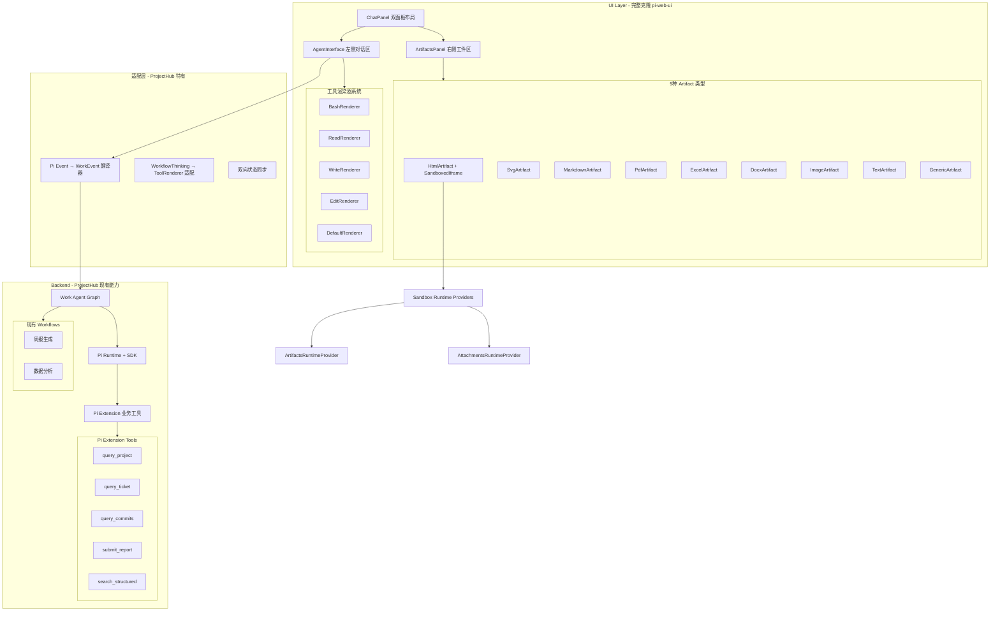

# AI 助手 Tab 完整重构计划（pi-web-ui 全克隆 + ProjectHub 融合版）

## 架构总览



## 核心设计原则

### 1. 完整克隆，零妥协

- 从 `~/workstation/pi-web-ui-ref/packages/web-ui/src/` 完整移植所有核心组件
- 不简化、不降级、保留所有功能（包括 SandboxedIframe、RuntimeProvider 机制）
- 将 Lit 组件改写为 React + TypeScript（保持相同的 API 接口）

### 2. 深度融合，非简单叠加

- Pi 事件流与 WorkEvent 双向映射
- Pi Extension 工具与 ProjectHub API 深度集成
- 保留现有所有业务功能（周报、工单、数据分析）

### 3. 分层架构，职责清晰

```
UI Layer (pi-web-ui 克隆)
    ↓ WorkEvent + ToolCall
Adapter Layer (翻译 + 适配)
    ↓ SubAgentEvent + Pi Extension
Backend Layer (ProjectHub 现有)
```

## 阶段划分（共 8 个 Phase）

### Phase 0: 基础设施准备（预计 4-6 小时）

**目标**: 搭建目录结构 + 创建类型定义 + 移植核心工具函数

#### 0.1 创建目录结构

```
features/ai/ui/
├── chat-workspace/                    # 新增：完整 AI 助手工作区
│   ├── ChatWorkspace.tsx             # 主容器（对应 pi ChatPanel）
│   ├── AgentInterface.tsx            # 左侧对话区
│   ├── MessageList.tsx               # 消息列表
│   ├── MessageEditor.tsx             # 输入编辑器
│   ├── StreamingMessageContainer.tsx # 流式渲染容器
│   └── ThinkingBlock.tsx             # Thinking 状态
│
├── artifacts/                         # 新增：Artifacts 系统
│   ├── ArtifactsPanel.tsx            # 右侧面板容器
│   ├── ArtifactPill.tsx              # 浮动触发 Badge
│   ├── ArtifactElement.tsx           # Artifact 基类
│   ├── artifact-store.ts             # Artifact 状态管理（Zustand）
│   │
│   ├── types/                        # 9 种 Artifact 实现
│   │   ├── HtmlArtifact.tsx         # HTML + 沙箱
│   │   ├── SvgArtifact.tsx          # SVG 预览
│   │   ├── MarkdownArtifact.tsx     # Markdown 渲染
│   │   ├── PdfArtifact.tsx          # PDF.js 预览
│   │   ├── ExcelArtifact.tsx        # SheetJS 预览
│   │   ├── DocxArtifact.tsx         # Docx 预览
│   │   ├── ImageArtifact.tsx        # 图片预览
│   │   ├── TextArtifact.tsx         # 文本预览
│   │   └── GenericArtifact.tsx      # 通用下载
│   │
│   ├── sandbox/                      # Sandbox 机制
│   │   ├── SandboxedIframe.tsx      # 安全沙箱 iframe
│   │   ├── RuntimeMessageBridge.ts  # 消息桥接
│   │   ├── RuntimeMessageRouter.ts  # 消息路由
│   │   ├── SandboxRuntimeProvider.ts# Runtime 接口
│   │   ├── ArtifactsRuntimeProvider.ts # Artifacts 提供者
│   │   ├── AttachmentsRuntimeProvider.ts # Attachments 提供者
│   │   └── ConsoleRuntimeProvider.ts    # Console 提供者
│   │
│   └── artifacts-tool.ts             # Artifacts Tool 实现（供 Pi 调用）
│
├── tool-renderers/                    # 新增：工具渲染器系统
│   ├── registry.ts                   # 渲染器注册表
│   ├── types.ts                      # 渲染器接口
│   ├── ToolCallCard.tsx              # 默认工具卡片
│   │
│   └── renderers/                    # 具体渲染器
│       ├── BashRenderer.tsx          # bash 执行结果
│       ├── ReadRenderer.tsx          # 文件读取
│       ├── WriteRenderer.tsx         # 文件写入
│       ├── EditRenderer.tsx          # 文件编辑
│       ├── GetCurrentTimeRenderer.tsx# 时间工具
│       ├── CalculateRenderer.tsx     # 计算器
│       ├── ExtractDocumentRenderer.tsx # 文档提取
│       ├── ArtifactsToolRenderer.tsx # artifacts 工具
│       └── DefaultRenderer.tsx       # 默认渲染器
│
├── adapters/                          # 新增：适配层
│   ├── work-event-adapter.ts         # Pi Event → WorkEvent
│   ├── tool-call-adapter.ts          # ToolCall 双向适配
│   └── state-sync.ts                 # 状态同步管理
│
└── work/                              # 现有目录（保留并改造）
    ├── WorkAgentWorkspace.tsx        # 改造：调用 ChatWorkspace
    ├── WorkTimeline.tsx              # 改造：使用 ToolRenderer
    └── ...（其他现有组件保留）
```

#### 0.2 创建核心类型定义

**新增文件**: `features/ai/ui/chat-workspace/types.ts`

```typescript
// Artifact 核心类型
export interface Artifact {
  filename: string;
  content: string;
  mimeType: string;
  createdAt: Date;
  updatedAt: Date;
}

export type ArtifactType = 
  | 'html' | 'svg' | 'markdown' | 'pdf' 
  | 'excel' | 'docx' | 'image' | 'text' | 'generic';

// Artifact 操作命令
export type ArtifactCommand = 
  | 'create' | 'update' | 'rewrite' 
  | 'get' | 'delete' | 'logs';

// Tool Renderer 接口
export interface ToolRenderResult {
  content: React.ReactNode;
  isCustom: boolean; // true = 无卡片包裹，false = 包裹在卡片中
}

export interface ToolRenderer<TParams = any, TResult = any> {
  render(
    params: TParams | undefined,
    result: TResult | undefined,
    isStreaming?: boolean
  ): ToolRenderResult;
}

// Message 类型（兼容 pi-web-ui）
export interface AgentMessage {
  role: 'user' | 'assistant' | 'tool' | 'system';
  content?: string;
  toolCalls?: ToolCall[];
  toolResults?: ToolResult[];
}

export interface ToolCall {
  id: string;
  tool: string;
  args: Record<string, unknown>;
}

export interface ToolResult {
  callId: string;
  success: boolean;
  result?: unknown;
  error?: string;
}

// Sandbox Runtime Provider 接口
export interface SandboxRuntimeProvider {
  getData(): Record<string, any>;
  getRuntime(): (sandboxId: string) => void;
  handleMessage?(
    sandboxId: string, 
    message: any
  ): Promise<any>;
}
```

#### 0.3 移植工具函数

从 pi-web-ui 移植以下工具模块（改写为 TypeScript）：

- `utils/attachment-utils.ts` → 附件处理
- `utils/i18n.ts` → 国际化（简化为中文）
- `utils/escape-script-content.ts` → HTML 转义
- `utils/validate-html.ts` → HTML 验证

**验收标准**:
- [ ] 目录结构创建完成
- [ ] 类型定义文件编译通过
- [ ] 工具函数单元测试通过

---

### Phase 1: Artifacts 核心系统（预计 10-14 小时）

**目标**: 实现完整的 Artifacts 存储、管理和基础预览能力

#### 1.1 Artifact Store（Zustand 状态管理）

**新增文件**: `features/ai/ui/artifacts/artifact-store.ts`

```typescript
import { create } from 'zustand';

interface ArtifactStore {
  artifacts: Map<string, Artifact>;
  activeFilename: string | null;
  
  // 操作方法（对应 pi-web-ui artifacts tool）
  createArtifact: (filename: string, content: string) => Promise<void>;
  updateArtifact: (filename: string, oldStr: string, newStr: string) => Promise<void>;
  rewriteArtifact: (filename: string, content: string) => Promise<void>;
  getArtifact: (filename: string) => Artifact | null;
  deleteArtifact: (filename: string) => Promise<void>;
  listArtifacts: () => string[];
  
  setActive: (filename: string | null) => void;
  clear: () => void;
}

export const useArtifactStore = create<ArtifactStore>((set, get) => ({
  artifacts: new Map(),
  activeFilename: null,
  
  createArtifact: async (filename, content) => {
    // 实现 create 逻辑
  },
  
  updateArtifact: async (filename, oldStr, newStr) => {
    // 实现 update 逻辑（字符串替换）
  },
  
  // ... 其他方法
}));
```

#### 1.2 ArtifactsPanel 容器

**新增文件**: `features/ai/ui/artifacts/ArtifactsPanel.tsx`

完整克隆 pi-web-ui `ArtifactsPanel.ts` 的所有功能：
- Artifact 列表管理（Tab 切换）
- 动态加载对应的 Artifact 组件
- 关闭按钮 + 浮动 Pill
- Overlay 模式（移动端）

#### 1.3 实现 9 种 Artifact 类型

**优先级 P0（本 Phase 完成）**:
1. **TextArtifact** - 最简单，纯文本预览
2. **MarkdownArtifact** - 使用 `react-markdown`
3. **ImageArtifact** - 使用 `` 标签
4. **HtmlArtifact** - 带简化沙箱（Phase 2 完善）

**优先级 P1（Phase 2 完成）**:
5. **SvgArtifact** - SVG 内联渲染
6. **PdfArtifact** - PDF.js 集成
7. **ExcelArtifact** - SheetJS 集成
8. **DocxArtifact** - docx-preview 集成
9. **GenericArtifact** - 通用下载

**依赖安装**:
```bash
npm install react-markdown pdf-dist xlsx docx-preview
npm install -D @types/pdf-dist
```

**验收标准**:
- [ ] Artifact Store 状态管理完整
- [ ] ArtifactsPanel 容器渲染正确
- [ ] P0 四种 Artifact 类型正常预览
- [ ] Artifact 增删改查操作正常

---

### Phase 2: SandboxedIframe 安全沙箱（预计 8-12 小时）

**目标**: 完整克隆 pi-web-ui 的沙箱机制，支持 HTML artifact 安全执行

#### 2.1 RuntimeMessageRouter（消息路由核心）

**新增文件**: `features/ai/ui/artifacts/sandbox/RuntimeMessageRouter.ts`

完整移植 pi-web-ui 的消息路由机制：
- `registerSandbox()` - 注册沙箱实例
- `unregisterSandbox()` - 清理沙箱
- `handleMessage()` - 处理 postMessage 通信
- `setSandboxIframe()` - 绑定 iframe 引用

#### 2.2 RuntimeMessageBridge（消息桥接）

**新增文件**: `features/ai/ui/artifacts/sandbox/RuntimeMessageBridge.ts`

实现 Host ↔ Sandbox 的双向消息通信：
- `sendRuntimeMessage()` - 发送消息到沙箱
- 消息序列化/反序列化
- 错误处理和超时机制

#### 2.3 Runtime Providers（3 个核心提供者）

**ArtifactsRuntimeProvider**:
- 提供 `window.getArtifact()` / `window.listArtifacts()` API
- 在线模式：通过 postMessage 与主窗口通信
- 离线模式：注入 artifacts 快照到 HTML

**AttachmentsRuntimeProvider**:
- 提供 `window.getAttachment()` / `window.listAttachments()` API
- 支持 HTML artifact 访问用户上传的附件

**ConsoleRuntimeProvider**:
- 劫持 `console.log/error/warn`
- 通过 postMessage 发送到主窗口
- 在 Console 面板展示

#### 2.4 SandboxedIframe 组件

**新增文件**: `features/ai/ui/artifacts/sandbox/SandboxedIframe.tsx`

完整克隆 pi-web-ui `SandboxedIframe.ts` 的所有功能：
- `loadContent()` - 加载 HTML 内容到沙箱
- `execute()` - 执行 JavaScript 代码（用于 REPL）
- `prepareHtmlDocument()` - 注入 Runtime Providers
- 沙箱权限：`allow-scripts`、`allow-modals`
- HTML 验证和错误处理

**关键安全机制**:
```typescript
// 注入 Runtime 代码到 HTML
const runtimeCode = providers.map(p => 
  `(${p.getRuntime().toString()})("${sandboxId}");`
).join('\n');

const completeHtml = `
<!DOCTYPE html>
<html>
<head>
  <script>
    ${runtimeCode}
  </script>
</head>
<body>
  ${htmlContent}
</body>
</html>
`;
```

**验收标准**:
- [ ] HTML artifact 可以在沙箱中安全执行
- [ ] Runtime Providers 正常工作（artifacts/attachments/console）
- [ ] postMessage 通信稳定
- [ ] 恶意脚本被沙箱隔离（安全测试）

---

### Phase 3: 工具渲染器系统（预计 8-10 小时）

**目标**: 实现完整的工具渲染器注册表 + 8 个核心渲染器

#### 3.1 ToolRenderer 注册表

**新增文件**: `features/ai/ui/tool-renderers/registry.ts`

```typescript
const toolRenderers = new Map<string, ToolRenderer>();

export function registerToolRenderer(
  toolName: string, 
  renderer: ToolRenderer
): void {
  toolRenderers.set(toolName, renderer);
}

export function getToolRenderer(
  toolName: string
): ToolRenderer | undefined {
  return toolRenderers.get(toolName);
}

// 自动注册所有渲染器
import { BashRenderer } from './renderers/BashRenderer';
import { ReadRenderer } from './renderers/ReadRenderer';
// ... 其他导入

registerToolRenderer('bash', new BashRenderer());
registerToolRenderer('read', new ReadRenderer());
// ... 其他注册
```

#### 3.2 实现 8 个核心渲染器

**P0 渲染器（Coding Tools）**:
1. **BashRenderer** - 命令执行结果（支持折叠、高亮）
2. **ReadRenderer** - 文件内容展示（语法高亮）
3. **WriteRenderer** - 文件创建提示
4. **EditRenderer** - Diff 视图（old_str → new_str）

**P1 渲染器（辅助工具）**:
5. **GetCurrentTimeRenderer** - 时间展示
6. **CalculateRenderer** - 计算结果
7. **ExtractDocumentRenderer** - 文档提取进度
8. **ArtifactsToolRenderer** - artifacts 操作提示

**P2 渲染器（兜底）**:
9. **DefaultRenderer** - 通用 JSON 展示

**渲染器接口示例**（BashRenderer）:
```typescript
export class BashRenderer implements ToolRenderer {
  render(params, result, isStreaming) {
    const { command } = params;
    const { stdout, stderr, exitCode } = result || {};
    
    if (isStreaming) {
      return {
        content: <BashStreamingView command={command} />,
        isCustom: false
      };
    }
    
    return {
      content: (
        <div className="space-y-2">
          <div className="flex items-center gap-2">
            <Terminal className="w-4 h-4" />
            <code className="text-xs">{command}</code>
          </div>
          {stdout && <pre className="bg-ink-50 p-2 rounded text-xs">{stdout}</pre>}
          {stderr && <pre className="bg-danger-50 p-2 rounded text-xs text-danger-900">{stderr}</pre>}
          <div className={exitCode === 0 ? "text-success-600" : "text-danger-600"}>
            Exit code: {exitCode}
          </div>
        </div>
      ),
      isCustom: false
    };
  }
}
```

**验收标准**:
- [ ] 渲染器注册表正常工作
- [ ] P0 四个 Coding Tools 渲染器完成
- [ ] 渲染器支持 streaming 状态
- [ ] 默认渲染器兜底正常

---

### Phase 4: Pi Extension 业务工具注册（预计 10-14 小时）

**目标**: 把 ProjectHub 业务工具注册进 Pi Runtime，让 Pi 可以调用

#### 4.1 Pi Extension 目录结构

```
features/ai/integrations/pi-extension/
├── index.ts                      # Extension 入口
├── tools/                        # 业务工具实现
│   ├── query-project.ts         # 查询项目信息
│   ├── query-ticket.ts          # 查询工单
│   ├── query-commits.ts         # 查询 Git 提交
│   ├── submit-report.ts         # 提交周报
│   └── search-structured.ts     # 结构化搜索（已有）
├── hooks/                       # Tool Call 拦截
│   └── tool-interceptor.ts     # HIL 拦截钩子
└── context/
    └── project-context.ts       # 项目上下文注入
```

#### 4.2 实现 5 个核心业务工具

**工具 1: query_project**

```typescript
// features/ai/integrations/pi-extension/tools/query-project.ts
import { tool } from '@langchain/core/tools';
import { z } from 'zod';

export const queryProjectTool = tool(
  async ({ projectId, fields }) => {
    // 调用 ProjectHub API
    const project = await prisma.project.findUnique({
      where: { id: projectId },
      select: {
        id: true,
        name: true,
        description: true,
        ownerId: true,
        ...(fields?.includes('tickets') && {
          tickets: {
            select: {
              ticketNo: true,
              title: true,
              status: true
            }
          }
        })
      }
    });
    
    return {
      success: true,
      data: project
    };
  },
  {
    name: 'query_project',
    description: 'Query project information by ID. Can include related tickets, members, and modules.',
    schema: z.object({
      projectId: z.string().describe('Project ID'),
      fields: z.array(z.enum(['tickets', 'members', 'modules'])).optional()
    })
  }
);
```

**工具 2: query_ticket**

查询工单详情（status / assignee / history）

**工具 3: query_commits**

查询最近 Git 提交（用于周报生成）

**工具 4: submit_report**

提交周报到数据库（替代现有的手动审批流程）

**工具 5: search_structured**

复用现有的 `searchStructuredTool`（已实现）

#### 4.3 Extension 注册到 Pi Runtime

**新增文件**: `features/ai/integrations/pi-extension/index.ts`

```typescript
import type { PiRuntime } from '@/features/ai/agents/work/subagents/pi/runtime';
import { queryProjectTool } from './tools/query-project';
import { queryTicketTool } from './tools/query-ticket';
// ... 其他工具

export function registerProjectHubExtension(runtime: PiRuntime) {
  // 注册工具到 Pi
  runtime.registerTool(queryProjectTool);
  runtime.registerTool(queryTicketTool);
  runtime.registerTool(queryCommitsTool);
  runtime.registerTool(submitReportTool);
  runtime.registerTool(searchStructuredTool);
  
  // 注册 Tool Call 拦截钩子（用于 HIL）
  runtime.registerHook('before_tool_call', toolInterceptor);
  
  console.log('[Pi Extension] ProjectHub tools registered:', [
    'query_project',
    'query_ticket',
    'query_commits',
    'submit_report',
    'search_structured'
  ]);
}
```

#### 4.4 在 Pi Runtime 启动时加载 Extension

**修改文件**: `features/ai/agents/work/subagents/pi/runtime.ts`

```typescript
import { registerProjectHubExtension } from '@/features/ai/integrations/pi-extension';

export async function createPiRuntime(
  transport: 'sdk' | 'rpc',
  options: PiRuntimeOptions
): Promise<PiRuntime> {
  const runtime = new PiRuntime(transport, options);
  
  // 加载 ProjectHub Extension
  registerProjectHubExtension(runtime);
  
  return runtime;
}
```

**验收标准**:
- [ ] 5 个业务工具注册成功
- [ ] Pi 可以调用 `query_project` 查询项目
- [ ] Pi 可以调用 `submit_report` 提交周报
- [ ] Tool Call 拦截钩子正常工作

---

### Phase 5: ChatWorkspace 双面板布局（预计 8-10 小时）

**目标**: 实现 pi-web-ui ChatPanel 的 React 版本

#### 5.1 ChatWorkspace 主容器

**新增文件**: `features/ai/ui/chat-workspace/ChatWorkspace.tsx`

完整克隆 pi-web-ui `ChatPanel.ts` 的布局逻辑：

```typescript
export function ChatWorkspace() {
  const [hasArtifacts, setHasArtifacts] = useState(false);
  const [artifactCount, setArtifactCount] = useState(0);
  const [showArtifactsPanel, setShowArtifactsPanel] = useState(false);
  const isMobile = useMediaQuery('(max-width: 1024px)');
  
  const artifacts = useArtifactStore(state => state.artifacts);
  
  useEffect(() => {
    setHasArtifacts(artifacts.size > 0);
    setArtifactCount(artifacts.size);
  }, [artifacts]);
  
  return (
    <div className="relative flex h-full w-full overflow-hidden">
      {/* 左侧：AgentInterface */}
      <div
        style={{
          width: !isMobile && showArtifactsPanel && hasArtifacts 
            ? "50%" 
            : "100%"
        }}
        className="h-full"
      >
        <AgentInterface />
      </div>
      
      {/* 浮动 Pill 触发器 */}
      {hasArtifacts && !showArtifactsPanel && (
        <button
          onClick={() => setShowArtifactsPanel(true)}
          className="pointer-events-auto absolute left-1/2 top-4 z-30 -translate-x-1/2"
        >
          <Badge>
            <FileCode2 className="w-3 h-3" />
            <span>Artifacts</span>
            <span className="artifact-badge">{artifactCount}</span>
          </Badge>
        </button>
      )}
      
      {/* 右侧：ArtifactsPanel */}
      <div
        className={isMobile ? "pointer-events-none absolute inset-0" : ""}
        style={{
          ...(!isMobile 
            ? (!hasArtifacts || !showArtifactsPanel 
                ? { display: "none" } 
                : { width: "50%" }
              )
            : {}
          )
        }}
      >
        <ArtifactsPanel
          collapsed={!showArtifactsPanel}
          overlay={isMobile}
          onClose={() => setShowArtifactsPanel(false)}
        />
      </div>
    </div>
  );
}
```

#### 5.2 AgentInterface 对话区

**新增文件**: `features/ai/ui/chat-workspace/AgentInterface.tsx`

实现完整的对话 UI：
- MessageList（消息列表）
- StreamingMessageContainer（流式渲染）
- MessageEditor（输入框）
- ThinkingBlock（思考状态）
- 工具渲染器集成

#### 5.3 流式渲染优化

**新增文件**: `features/ai/ui/chat-workspace/StreamingMessageContainer.tsx`

克隆 pi-web-ui 的 `requestAnimationFrame` 批量更新机制：

```typescript
export function StreamingMessageContainer({ message }: Props) {
  const [displayMessage, setDisplayMessage] = useState(message);
  const updateScheduled = useRef(false);
  const pendingMessage = useRef<Message | null>(null);
  
  useEffect(() => {
    if (updateScheduled.current) return;
    
    updateScheduled.current = true;
    pendingMessage.current = message;
    
    requestAnimationFrame(() => {
      if (pendingMessage.current) {
        setDisplayMessage(pendingMessage.current);
      }
      updateScheduled.current = false;
      pendingMessage.current = null;
    });
  }, [message]);
  
  return (
    <div className="message-container">
      {/* 渲染 displayMessage */}
    </div>
  );
}
```

**验收标准**:
- [ ] 双面板布局在桌面端正确显示（50% / 50%）
- [ ] 移动端 < 1024px 时右侧改为浮层
- [ ] 浮动 Pill 在有 artifacts 时显示
- [ ] 流式渲染性能优化生效（60fps）

---

### Phase 6: 事件流适配层（预计 6-8 小时）

**目标**: 实现 Pi Event ↔ WorkEvent 的双向翻译

#### 6.1 WorkEvent Adapter

**新增文件**: `features/ai/ui/adapters/work-event-adapter.ts`

```typescript
import type { SubAgentEvent } from '@/features/ai/agents/work/subagents/types';
import type { WorkEvent } from '@/features/ai/core/runtime/work-event';

export class WorkEventAdapter {
  // Pi Event → WorkEvent
  translateFromPi(piEvent: SubAgentEvent): WorkEvent {
    switch (piEvent.type) {
      case 'run_started':
        return {
          type: 'pi_run_started',
          payload: {
            runId: piEvent.runId,
            sessionId: piEvent.sessionId
          }
        };
        
      case 'tool_call':
        return {
          type: 'pi_tool_call',
          payload: {
            eventId: piEvent.eventId,
            tool: piEvent.tool,
            args: piEvent.args,
            callId: piEvent.callId
          }
        };
        
      case 'tool_result':
        return {
          type: 'pi_tool_result',
          payload: {
            callId: piEvent.callId,
            result: piEvent.result,
            success: piEvent.success
          }
        };
        
      // ... 其他事件类型
    }
  }
  
  // WorkEvent → UI State
  applyToUIState(event: WorkEvent, setState: (fn) => void): void {
    // 更新 UI 状态（messages / toolCalls / artifacts）
  }
}
```

#### 6.2 Tool Call Adapter

适配现有的 `WorkflowThinking` → 新的 `ToolRenderer` 系统

**验收标准**:
- [ ] Pi 事件流正确翻译为 WorkEvent
- [ ] UI 状态同步正常（消息 / 工具调用 / artifacts）
- [ ] 现有 WorkEvent 订阅者不受影响

---

### Phase 7: 集成测试与回归（预计 6-8 小时）

**目标**: 确保新 UI 不破坏现有功能

#### 7.1 功能回归测试

**测试场景清单**:
1. **周报生成** - 输入"帮我生成周报" → 工作流启动 → 草稿生成 → 审批 → 提交
2. **Coding 任务** - 输入"重构 ticket 模块" → Pi 启动 → tool_call 展示 → 代码修改
3. **工单查询** - Pi 调用 `query_ticket` → 返回工单详情 → 在消息中展示
4. **HTML Artifact** - Pi 生成 HTML → 创建 artifact → 沙箱预览
5. **Markdown Artifact** - Pi 生成 Markdown → 渲染预览
6. **审批流程** - Pi 调用危险命令 → HIL 拦截 → 审批弹窗 → approve/deny

#### 7.2 性能测试

- 流式渲染帧率测试（目标 60fps）
- 大量 artifacts 加载测试（> 20 个）
- 长时间运行稳定性测试（> 30 分钟）

#### 7.3 安全测试

- 沙箱隔离测试（尝试访问 `parent.document`）
- XSS 防护测试（恶意 HTML artifact）
- postMessage 劫持测试

**验收标准**:
- [ ] 所有测试场景通过
- [ ] 性能指标达标
- [ ] 安全测试无漏洞
- [ ] `npm run lint` 无错误
- [ ] `npm run test` 全部通过
- [ ] `npm run build` 成功

---

### Phase 8: UI 美化与文档（预计 4-6 小时）

**目标**: 应用 pretty-ui design token + 生成复现文档

#### 8.1 UI 美化

参考 `pretty-ui/SKILL.md`：
- 替换 emoji 为 lucide 图标
- 应用 `--color-brand-*` / `--color-ink-*` 变量
- 统一圆角（`rounded-xl` 面板 / `rounded-lg` 卡片）
- 统一间距（`space-y-6` 区块 / `gap-3` 组件）

#### 8.2 生成复现文档

使用 `dev-to-doc-recap` skill 生成：

**产物**: `docs/ai/phase-7-ai-tab-complete-refactor.md`

包含：
- 改造前后对比（截图 + 架构图）
- 9 种 Artifacts 类型说明
- 工具渲染器系统使用指南
- Pi Extension 工具列表
- Sandbox 安全机制说明
- 验收测试结果

**验收标准**:
- [ ] UI 美化完成（无 emoji、统一 token）
- [ ] 复现文档生成（> 500 行）
- [ ] 截图和架构图齐全

---

## 总体估时

| Phase | 任务 | 预估时间 |
|-------|------|---------|
| Phase 0 | 基础设施准备 | 4-6 小时 |
| Phase 1 | Artifacts 核心系统 | 10-14 小时 |
| Phase 2 | SandboxedIframe 安全沙箱 | 8-12 小时 |
| Phase 3 | 工具渲染器系统 | 8-10 小时 |
| Phase 4 | Pi Extension 业务工具 | 10-14 小时 |
| Phase 5 | ChatWorkspace 双面板布局 | 8-10 小时 |
| Phase 6 | 事件流适配层 | 6-8 小时 |
| Phase 7 | 集成测试与回归 | 6-8 小时 |
| Phase 8 | UI 美化与文档 | 4-6 小时 |
| **合计** | | **64-88 小时（8-11 个工作日）** |

## 关键依赖

### NPM 包新增

```json
{
  "dependencies": {
    "react-markdown": "^9.0.0",
    "pdf-dist": "^4.0.0",
    "xlsx": "^0.18.5",
    "docx-preview": "^0.3.0",
    "zustand": "^4.5.0",
    "lucide-react": "^0.344.0"
  },
  "devDependencies": {
    "@types/pdf-dist": "^2.10.0"
  }
}
```

### 外部资源

- pi-web-ui 本地参考：`~/workstation/pi-web-ui-ref/packages/web-ui/src/`
- Pi SDK 文档：`node_modules/@mariozechner/pi-coding-agent/README.md`

## 风险与缓解

| 风险 | 影响 | 缓解措施 |
|------|------|---------|
| Lit → React 转换难度 | 高 | 逐组件迁移，优先核心功能 |
| Sandbox 安全漏洞 | 高 | 完整复制 pi-web-ui 的安全机制 + 渗透测试 |
| Pi Extension API 不稳定 | 中 | 参考官方文档 + 社区案例 |
| 性能回归（大量 artifacts） | 中 | requestAnimationFrame 优化 + 虚拟滚动 |
| 现有功能破坏 | 高 | Phase 7 完整回归测试 |

## 验收总清单

- [ ] 9 种 Artifacts 类型全部实现
- [ ] 8 个工具渲染器正常工作
- [ ] Pi Extension 5 个业务工具可调用
- [ ] SandboxedIframe 安全沙箱无漏洞
- [ ] 双面板布局响应式正常
- [ ] 现有所有功能回归测试通过
- [ ] 性能达标（60fps 流式渲染）
- [ ] 复现文档完整（> 500 行）
- [ ] `npm run lint && npm run test && npm run build` 全部通过

## Subagent 分工（Mode L）

按 `subagent-coordination-sop.mdc` SOP：

| Agent | 职责 | 产物 |
|-------|------|------|
| `fullstack-developer` (Phase 0-5) | 基础设施 + Artifacts + Sandbox + Workspace | 核心 UI 组件 + 类型定义 |
| `fullstack-developer` (Phase 4) | Pi Extension 实现 | 5 个业务工具 + 注册逻辑 |
| `fullstack-developer` (Phase 6) | 事件流适配 | Adapter 层 |
| `code-reviewer` (Phase 7) | 硬层审查（类型/安全/性能） | `docs/reviews/PR<N>-ai-tab-code-reviewer.md` |
| `ai-learning-mentor` (Phase 7) | 软层审查（架构/边界） | `docs/reviews/PR<N>-ai-tab-ai-mentor.md` |

Main 在 Phase 7 末尾合并审查报告 → Phase 8 User Decide → 按 `git-commit-required.mdc` 提交。

## 关键约束

1. **不破坏现有功能** - WorkEvent / SSE / dispatch / 周报 / 工单查询全部保留
2. **不动 schema public** - 不碰 prisma
3. **不引入破坏性依赖** - 只加 UI 库，不改核心架构
4. **commit 必须带单号** - 按 `git-commit-assistant/SKILL.md` 9 步流程
5. **默认推 origin** - 除非明确说推 github
6. **完整克隆，零妥协** - pi-web-ui 所有核心能力必须保留