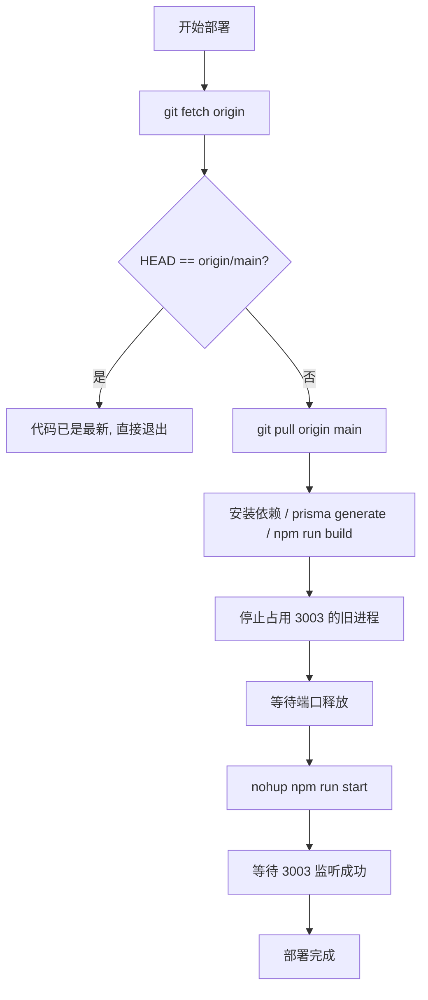

# `scripts/deploy.sh` 使用手册与运维说明

## 1. 脚本用途

`[scripts/deploy.sh](scripts/deploy.sh)` 是本项目的"一键部署"脚本，用于在服务器上执行以下流程：

1. 拉取远端 `origin/main` 的最新代码
2. 对比本地 `HEAD` 与远端 `origin/main`，判断是否真的有更新
3. 仅在有更新时才安装依赖、生成 Prisma Client、执行生产构建
4. 仅在有更新时才停止占用 3003 端口的旧服务
5. 启动新的生产服务，并确认 3003 端口已监听

这个脚本适合当前项目这种单机、单实例、端口固定为 `3003` 的部署场景。它不是通用发布系统，也不是回滚工具。

## 2. 运行前提

执行前请确认以下条件：

- 当前机器已安装 `bash`、`git`、`node`、`npm`、`npx`、`ss` 等命令
- 仓库路径固定为：`/home/hxy/work/personal/project-manager`
- 生产服务监听端口固定为 `3003`
- 数据库和环境变量已配置完成，尤其是：
  - `DATABASE_URL`
  - `AUTH_SECRET` / `NEXTAUTH_SECRET`
  - `AUTH_TRUST_HOST=true`
- 不要设置 `AUTH_URL` / `NEXTAUTH_URL`，否则可能触发 localhost 跳转问题
- 推荐通过 bare repo 的 post-receive hook 实现推送即部署，无需 crontab 轮询

建议在执行前先确认当前工作树没有未提交的本地改动，避免 `git pull` 合并时引入不必要的冲突。

## 3. 使用方式

**方式一：推送到 bare repo 自动部署（推荐）**

本地 push 到服务器 bare 仓库，post-receive hook 会自动触发部署：

```bash
git push origin main
```

hook 配置在 `/home/hxy/work/personal/project-manager.git/hooks/post-receive`，无需任何手动操作。

**方式二：手动执行**

在服务器上进入仓库目录后直接执行：

```bash
bash scripts/deploy.sh
```

脚本内部写死了工作目录，因此即使当前 shell 不在项目目录下，也会切换到：

```bash
/home/hxy/work/personal/project-manager
```

## 4. 脚本执行流程

脚本的核心流程如下：



### 4.1 更新检查

脚本先执行 `git fetch origin`，然后对比：

- `git rev-parse HEAD`
- `git rev-parse origin/main`

如果两者一致，说明本地代码已经和远端 `main` 对齐，脚本会直接输出"代码已是最新"和"无需重启，保持当前服务运行"，然后退出，不会再杀端口，也不会重新启动服务。

如果两者不一致，说明远端有更新，脚本会先执行 `git pull origin main`，再继续后续构建和重启流程。

### 4.2 是否需要构建的判断

当前脚本不再依赖 `.next/BUILD_ID` 来判断是否重启。

原因是：

- `BUILD_ID` 只能说明"有构建产物"
- 它不能可靠说明"构建是否对应当前代码"
- 也不能作为"是否需要重启"的唯一依据

所以现在的判断逻辑改成了更直接、更可靠的方式：

- `HEAD == origin/main` → 没有更新 → 不重启
- `HEAD != origin/main` → 有更新 → 构建并重启

### 4.3 构建阶段

需要部署时会按顺序执行：

1. `npm install`
2. `npx prisma generate`
3. `npm run build`

任一步失败都会立即退出，并且不会主动切换服务。

### 4.4 服务切换

构建成功后，脚本会：

1. 停止占用 `3003` 端口的进程
2. 等待端口释放
3. 使用 `nohup npm run start` 启动新服务
4. 轮询 `3003` 端口是否已监听成功

如果 20 秒内没有监听成功，脚本会认为启动失败。

### 4.5 并发保护

脚本增加了部署锁：

- 如果上一轮部署还在执行，下一轮会直接跳过
- 这样可以避免重复杀进程、重复启动、以及 `EADDRINUSE` 这种端口冲突问题

## 5. 日志与排障

脚本日志写入：

```bash
/tmp/pm-deploy.log
```

常用排查命令：

```bash
tail -60 /tmp/pm-deploy.log
ss -ltnp | grep :3003
```

如果部署失败，优先查看 `/tmp/pm-deploy.log` 中最后一段输出，通常能定位到：

- 依赖安装失败
- Prisma Client 生成失败
- 构建失败
- 旧进程未释放端口
- 新服务启动后立即退出
- 启动超时
- 并发部署被锁定跳过

## 6. 使用风险

### 6.1 误杀同端口进程

脚本会通过端口 `3003` 查找并 `kill` 目标进程。虽然当前过滤了 `next-server`、`node`，但它仍然是"按端口杀进程"的策略，存在误伤同端口上其他服务的风险。

### 6.2 `git pull` 可能引入冲突或意外变更

脚本默认部署 `origin/main`。如果本地工作树有未提交改动，或者远端分支出现非预期提交，`git pull` 可能失败或把不该上线的内容带入生产。

### 6.3 旧服务可能已被停止，但新服务未成功起来

脚本在构建成功后会先停止旧服务，再启动新服务。若 `npm run start` 失败，短时间内可能出现服务中断。

### 6.4 端口监听成功不等于应用完全可用

脚本只检查 `3003` 端口是否监听，并不验证：

- 页面是否可正常渲染
- 数据库是否连通
- 登录是否正常
- 核心 API 是否返回正确结果

因此"启动成功"不等于"业务可用"。

### 6.5 `npm install` 带来不可控的依赖变化

脚本每次需要构建时都会执行 `npm install`，这会让部署依赖于当下 registry、锁文件和网络状态，也可能引入非预期的小版本变化。

### 6.6 生产环境对固定路径和固定端口依赖很强

脚本写死了项目路径、日志路径和端口。如果机器目录或部署方式变化，需要同步修改脚本，否则会直接失败。

## 7. 建议的使用边界

适合：

- 单机部署
- 单实例服务
- 推送即部署（通过 post-receive hook）
- `main` 分支即生产分支

不适合：

- 多环境灰度发布
- 多副本负载均衡
- 需要严格回滚能力的场景
- 有复杂审批、审计、发布窗口要求的场景

## 8. 维护与升级方向

当前的 `scripts/deploy.sh` 属于单机脚本部署方式，虽然已经可以完成拉取代码、构建和启动服务的流程，但整体仍然依赖服务器环境，属于比较基础的部署方式。后续可以逐步升级，但不需要一开始就做复杂的 CI/CD 或蓝绿发布，优先推荐走更简单、更稳的路线。

第一步可以先引入 PM2 来替代现在的 `nohup + 手动 kill` 进程方式，这样可以让 Node 服务变成守护进程，自动重启、自动记录日志，也避免端口占用和进程残留的问题，部署脚本也会变得更简单，只需要 `pm2 restart` 就可以完成更新。

在 PM2 稳定之后，可以进一步把构建流程稍微规范一下，比如统一在服务器上执行 `npm ci → prisma generate → npm run build`，确保每次构建环境一致，避免出现依赖或 Prisma 类型不同步导致的构建失败问题。

再往后如果项目变大，可以再考虑把"构建"和"运行"拆开，也就是在 CI（比如 GitHub Actions）里完成 build，把构建产物部署到服务器，服务器只负责启动，这样可以避免生产环境依赖网络和构建工具，让部署更稳定。

最后如果系统继续扩大，可以再升级到 Docker，把整个应用（Node + 依赖 + 构建环境）打成一个镜像，这样部署就变成拉镜像并运行容器，环境完全一致，不再依赖服务器本地配置，也更方便以后扩展多实例或者做负载均衡。

整体演进路线就是：先把当前脚本稳定下来（修复进程管理问题）→ 再用 PM2 简化运维 → 再把构建流程标准化 → 最后再逐步过渡到 CI/CD 或 Docker 容器化部署，这样是最平滑、风险最低的一条升级路径。

## 9. 推荐的运维习惯

- 部署前先确认当前分支和远端分支
- 部署后先检查 `3003` 端口，再用浏览器或 `curl` 验证首页
- 一旦失败，先看 `/tmp/pm-deploy.log`，不要反复手动重启覆盖问题现场
- 如果后续准备长期维护，优先把部署流程迁移到 systemd 或 CI/CD

## 10. 与现有运维文档的关系

现有的 `[docs/OPERATIONS.md](docs/OPERATIONS.md)` 已经说明了环境变量、首次部署、systemd 和手动重启方式。本手册补充的是 `scripts/deploy.sh` 的具体运行机制、风险和后续升级方向。两者建议并存：

- `docs/OPERATIONS.md` 负责"怎么运维"
- 本文档负责"怎么用部署脚本、有哪些风险、后面怎么升级"
