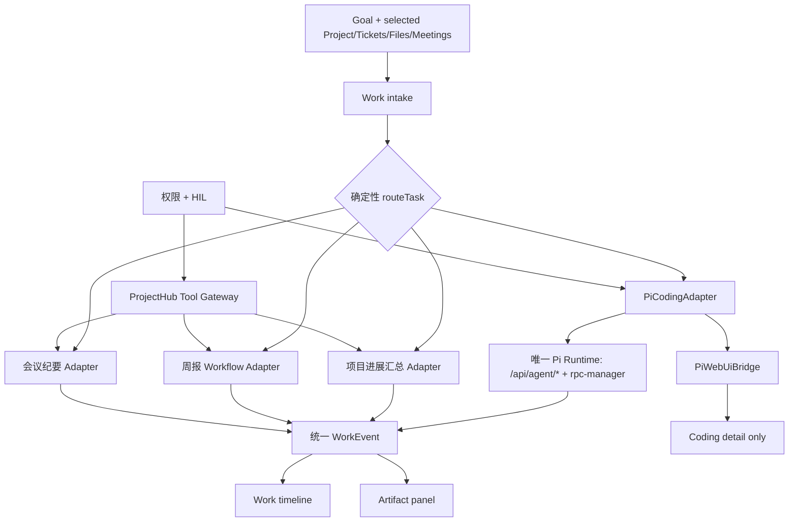
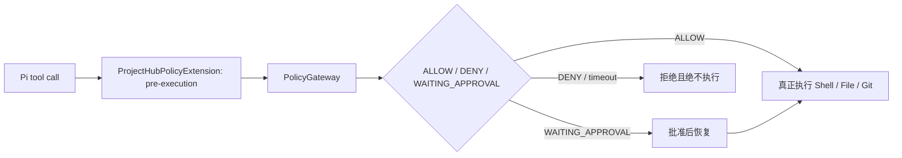

# ProjectHub Work 与 Pi Web：架构及迁移设计

> **状态：实施基线；评审 P0/P1 已纳入，尚未上线。**
> **范围：本设计指导本地分阶段实施；生产启用、远程部署和旧链物理删除另行发布。**
> **设计基线：ProjectHub `bcf4ca5f05307a4afb92f9dd3e548e5fd14c2422`；当前仓库无 Git submodule。**

## 1. 决策摘要

| 入口 | 产品定位 | 首期职责 | 不承担的职责 |
| --- | --- | --- | --- |
| `/ai?m=chat` | 对话模式 | 现有问答、RAG、项目/工单查询、语音及生成能力 | Work 编排、Coding Workspace |
| `/ai?m=work` | 通用办公任务执行台（对标 ChatGPT Work） | 接收目标、确定性分诊、上下文、时间线、HIL、Artifact | 通用 LLM Planner、Browser Runtime、第二套 Pi Runtime |
| `/ai-workspace` | Coding Workspace（对标 Codex） | 完整 Pi Web Chat、文件、Diff、Shell、Session | 业务 Work 首页与业务工具编排 |

**关键决定**：Pi Web 不等于 Work。Pi 是 Work 的 Coding Runtime；只有 Coding 任务详情经 `PiWebUiBridge` 呈现 Pi Web 能力。首期不建额外通用任务表：周报继续以 `WorkflowRun`，会议继续以 `ProjectMeeting`，Coding 以 Pi Session 的最小归属记录关联既有业务对象。

## 2. 三层边界与依赖规则

```mermaid
flowchart TB
  subgraph U[PI_WEB_UPSTREAM]
    PiUi[Pi Web UI core]
    PiApi[Pi session protocol/types]
  end
  subgraph I[PROJECTHUB_PI_INTEGRATION]
    Auth[ProjectHub auth + ownership]
    Models[AI model registry import]
    Rpc[Pi runtime adapter]
    Bridge[PiWebUiBridge]
  end
  subgraph W[PROJECTHUB_WORK]
    Orchestrator[Work Orchestrator]
    Gateway[ProjectHub Tool Gateway]
    HIL[HIL / policy]
    Artifacts[Artifact projection]
  end

  W --> I
  I --> U
  W --> Weekly[WorkflowRun / weekly-report]
  W --> Meeting[ProjectMeeting]
  Rpc --> AgentApi[/api/agent/* + lib/rpc-manager.ts]
```

### 2.1 `PI_WEB_UPSTREAM`

可随 agegr/pi-web 上游同步的核心 UI、纯客户端状态、协议类型及其紧邻测试。禁止引用 ProjectHub 业务模型、Prisma、权限服务或业务 API；若必须改动，上游文件只保留极小 `PROJECTHUB_PATCH`，其它能力下沉到 Integration。

### 2.2 `PROJECTHUB_PI_INTEGRATION`

本站所有差异化代码：Next 路由包装、`requireSession`、用户模型配置导入、Session 所有权、数据转换、Pi Runtime 单例接入、Pi Web 容器及桥接。此层可以依赖上游；上游不得反向依赖此层。

### 2.3 `PROJECTHUB_WORK`

通用 Work Orchestrator、确定性任务路由、ProjectHub Tool Gateway、生命周期/事件、HIL、Artifact 与办公任务 UI。它仅依赖 Integration 暴露的稳定接口，**不得**直接 import Pi Web 内部组件、`rpc-manager` 或 Pi SDK。

## 3. 当前调用链（代码事实）

### 3.1 Chat 与当前 Work UI

```mermaid
flowchart LR
  AI[/ai] --> Page[app/ai/page.tsx]
  Page --> ChatPage[features/ai/ui/ai-chat/AiChatPage.tsx]
  ChatPage -->|m != work| Chat[AiChatPanel]
  ChatPage -->|m=work| LegacyPanel[WorkModePanel]
  LegacyPanel --> WorkflowApi[/api/ai/workflows]
  LegacyPanel --> LegacyRun[/api/ai/work/run]
  WorkflowApi --> Weekly[weekly-report LangGraph + WorkflowRun]
  LegacyRun --> LegacyGraph[WorkAgentGraph + PiSubAgent]
  ChatPage --> Status[WorkflowStatus]
```

- `app/ai/page.tsx` 始终渲染 `AiChatPage`。
- `AiChatPage.tsx` 以 `?m=work` 在 `conversation` 与 `work` 间切换；Work 分支渲染 `features/ai/ui/ai-work/WorkDashboard.tsx`，其保留 `WorkflowLauncher` 作为周报的确定性业务入口，并由统一的任务列表/详情承载其它办公任务。
- 周报已不是纯 Pi 流程：`app/api/ai/workflows/route.ts` 调 `features/ai/agents/work/workflows/weekly-report/approval.ts`，运行记录存在 Prisma `WorkflowRun`（`workflowType`、`threadId`、`status`、`history`、`userId`）。

### 3.2 旧 Work Agent / 重复 Coding Runtime

```mermaid
flowchart LR
  LegacyWork[/api/ai/work/run] --> Graph[work/graph.ts]
  Graph --> Router[router/*]
  Graph --> WeeklyGraph[weekly-report graph]
  LegacyWork --> PiSub[PiSubAgent]
  PiSub --> Sdk[PiSdkRuntime]
  LegacyWork --> SSE[手工 SSE 映射]
```

- `app/api/ai/work/run/route.ts` 初始化 `getWorkAgentGraph()`，且在同一 SSE 路由中再次调用 `getPiSubAgent()` 与 `handleCodingTask()`；它同时承担编排、Pi 启动和事件转换。
- `features/ai/agents/work/graph.ts` 的 `executeCodingNode`/`dispatchNode` 已将 Coding 与 workflow 混在同一 Graph。
- `features/ai/agents/work/subagents/pi/transports/sdk.ts` 的 `PiSdkRuntime` 是第二条 Pi SDK 执行链；`features/ai/agents/work/tools/{read-resource,write-file,edit-file,execute-command}.ts` 又维护了一组重叠读写 Shell 工具。
- `app/api/ai/work/approve/route.ts` 仍直接依赖 `PiSubAgent`。这些都是迁移完成后才可删除的遗留实现。

### 3.3 会议纪要与周报业务链

```mermaid
flowchart LR
  MeetingApi[/api/projects/:id/meetings] --> PM[ProjectMeeting]
  PM --> Transcribe[transcribe/summarize]
  PM --> Review[PENDING_REVIEW]
  Review --> Publish[/meetings/:meetingId/publish]
  Publish --> Doc[项目 Document/FileAsset]
  Weekly[weekly-report graph] --> WR[WorkflowRun]
  WR --> Report[WeeklyReport.workflowRunId]
```

- Prisma `ProjectMeeting` 有 `creatorId`、`projectId`、音频、原始转写、AI/草稿/发布摘要、`ProjectMeetingStatus`（含 `PENDING_REVIEW`/`PUBLISHED`）及发布文档关联；对应 API 在 `app/api/projects/[id]/meetings/**`，UI 在 `features/project/ui/ProjectMeetingTab.tsx` 与 `ProjectMeetingDetailModal.tsx`。
- Prisma `WeeklyReport` 通过 `workflowRunId` 软关联 `WorkflowRun`；周报业务 UI/API 位于 `features/reports/weekly-reports/**`、`app/api/reports/weekly-reports/**`。

### 3.4 当前 Pi Workspace、模型导入和 Session 链

```mermaid
flowchart LR
  Workspace[/ai-workspace] --> Client[app/ai-workspace/client.tsx]
  Client --> Shell[ai-workspace/AppShell]
  Shell --> Agent[/api/agent/new, :id, events]
  Agent --> Rpc[lib/rpc-manager.ts]
  Shell --> Sessions[/api/sessions/*]
  ModelUI[ModelSettings] --> Adapter[models-config-adapter.ts]
  Adapter --> Registry[/api/ai/models/registry]
  Registry --> Unified[lib/unified-model-registry.ts]
  Unified --> Db[UserApiKey + UserAiModelPreference]
  Unified --> Local[~/.pi/agent/models.json]
```

- `app/ai-workspace/client.tsx` 是目前唯一将站点壳、`I18nProvider`、样式和 Pi Web `AppShell` 组合的入口；已实现嵌入与 `?fullscreen=1` 全屏模式。
- `app/api/agent/new/route.ts` 仅调用 `requireSession()`，再 `startRpcSession()`；`app/api/sessions/route.ts` 也仅做登录校验后合并本地会话文件和内存 RPC 会话。当前并未把 Pi 的真实 `sessionId` 持久化为 user owner，因此登录校验不是资源所有权校验。
- `features/ai/ui/ai-workspace/models-config-adapter.ts` 通过 `/api/ai/models/registry` 读取合并模型；保存时调用 `/api/models-config`。`app/api/ai/models/registry/route.ts` 合并 ProjectHub `UserApiKey`/发现结果和 `~/.pi/agent/models.json`，并强调本地字段无损往返。这是上游同步的重点保护链。

## 4. 目标架构



### 4.1 Work Orchestrator

`intake → routeTask → execute adapter → review/approval → finalizeArtifact`。

首期只允许确定性路由（关键字 + 明确结构化入口），而非任意 LLM 规划：

| 路由 | 输入上下文 | 执行器 | Artifact |
| --- | --- | --- | --- |
| `project_progress` | project、时间范围、工单、Git 提交 | Project progress adapter | 进度/风险/建议报告 |
| `weekly_report` | project、时间范围、工单、Git、已发布会议 | 既有 weekly-report workflow | 草稿、审核结果、`WeeklyReport` |
| `meeting_minutes` | project、会议音频/会议 ID | 既有 `ProjectMeeting` 链 | 转写、草稿、发布文档 |
| `coding` | ticket/project、repo/cwd、任务说明 | `PiCodingAdapter` | Session 深链、事件、Diff、测试摘要 |

为后续 Planner 保留 `TaskRoute` 与 `WorkExecutor` 接口，但**不实现**动态 Planner、Browser Runtime，也不建通用任务表。

### 4.2 ProjectHub Tool Gateway

所有 Work 业务数据访问经过 Gateway，而非让 Pi 或 Graph 直接读数据库。

| 工具组 | 首期能力 | 控制 |
| --- | --- | --- |
| 只读 | 项目、工单、Git 提交、知识库检索、周报/会议摘要 | `requireSession` + 项目成员/角色范围过滤 + 审计上下文 |
| 写入 | 项目/工单更新、指派、状态变更 | 现有领域服务和事务；权限校验；HIL 批准后执行；保留状态/指派历史 |
| Coding | 创建、读取、继续、取消 Pi Session；读取 Diff/测试摘要 | `PiCodingAdapter` + Session owner guard；高风险命令进 HIL |

HIL 是横切点：业务写入以及高风险 Coding（例如破坏性命令、敏感目录、发布/推送）均生成 approval request；它不是一个可被路由的独立执行器。

### 4.3 `ProjectHubPolicyExtension`：执行前 HIL

Pi 的工具调用必须在 Runtime 执行工具之前经过 Integration 层的 `ProjectHubPolicyExtension`，而不是由 Work 事件消费者事后判断：



Extension 以 Pi runtime 的工具拦截点注册，不等待 `tool_call` 事件；`WAITING_APPROVAL` 必须暂停同一工具调用，批准才恢复，拒绝/超时关闭调用。测试必须以 fake Shell/File/Git executor 证明：批准前调用次数为零。旧 `PiSdkRuntime` 中标注“TODO Phase 5 P1: 集成 Policy Gateway”的事件 hook 不能作为新实现依据。

### 4.4 `PiCodingAdapter` 与 `PiWebUiBridge`

- `PiCodingAdapter` 是 Work → Integration 的服务接口：创建/继续/取消 Pi Session，传入已授权的 ticket/project 上下文，转换 `/api/agent/*` 事件为 `WorkEvent`，输出 session 深链、变更文件、Diff、测试摘要与失败状态。
- 它只能调用唯一 Runtime 契约（`/api/agent/*` 与 `lib/rpc-manager.ts` 的服务封装）；禁止 import `PiSubAgent`、`PiSdkRuntime`，禁止 Work 自建 `read/write/edit/bash`。
- `PiWebUiBridge` 是 Integration 的 React 容器/props 适配层，向 Work 暴露稳定的 `CodingSessionView`、`CodingEventTimeline`、`ChangesSummary`。Work 只能 import Bridge 导出，不得 import `features/ai/ui/ai-workspace/**`。
- Coding 详情可展示 Pi Web；Work 首页只展示目标、上下文、任务列表、时间线、审批和 Artifact。

### 4.5 刷新恢复：`WorkRunRef` read projection

Work 不新建通用任务表；任务列表、时间线和 Artifact 都是可重建的 read projection：

```ts
type WorkRunRef =
  | { kind: "project_progress"; source: "WorkflowRun"; sourceId: string }
  | { kind: "weekly_report"; source: "WorkflowRun"; sourceId: string }
  | { kind: "meeting_minutes"; source: "ProjectMeeting"; sourceId: string }
  | { kind: "coding"; source: "PiSessionOwnership"; sourceId: string };
```

项目进展汇总创建既有 `WorkflowRun`，固定 `workflowType = "project-progress"`；周报继续使用 `workflowType = "weekly_report"`；会议从 `ProjectMeeting` 状态及文档关联恢复；Coding 从 `PiSessionOwnership` 加上最近的 `SubAgentRun`/`PolicyAuditLog` 恢复。刷新后 Work API 按当前用户和项目权限查询上述记录，投影为统一 `WorkRunRef` 和 `WorkEvent`，不依赖内存 run。
## 5. Pi Session 所有权设计（计划中的最小迁移）

### 5.1 关系与最小迁移

新增窄表 `PiSessionOwnership`，它是长期 Pi Session 的唯一 owner projection，不改变 Pi session 文件：`id`、`piSessionId @unique`、`userId`（FK `User`，cascade）、`projectId?`、`ticketId?`、`source`（`workspace | work_coding`）、`createdAt`、`updatedAt`、`deletedAt?`；索引 `@@index([userId, updatedAt(sort: Desc)])`、`@@index([projectId])`、`@@index([ticketId])`。

它与既有记录的关系固定如下：

| 记录 | 生命周期 | 关联规则 |
| --- | --- | --- |
| `PiSessionOwnership` | 一个长期 Pi session 一条 | 所有 Workspace/Work session 均须有唯一 owner |
| `SubAgentRun` | 一次 Work Coding execution；同一 Session 可有多个 | Work Coding 必须建 execution run，并保存该 `sessionId` |
| `PolicyAuditLog` | 一项工具策略决策 | 继续通过 `runId → SubAgentRun.runId` 关联具体 execution，不改为关联 session |

AI Workspace 创建、但从未被 Work 调用的 Session 可以只有 ownership；Work Coding 绝不能只有 ownership。该表不是通用 Work 任务表。

### 5.2 Saga、兼容与回滚

RPC 进程、Pi session 文件和 PostgreSQL 不可能置于同一个事务，创建采取 Saga：

```text
启动 Runtime → 得到真实 sessionId → 写 PiSessionOwnership →（Work 时写 SubAgentRun）
  → 任一步写入失败：关闭 Runtime、删除未暴露 Session、返回失败
  → 全部成功：才向客户端返回 sessionId
```

旧会话不盲目回填：仅从可信 ProjectHub 关联推导 owner；其余标为 legacy/unclaimed，只能 ROOT 运维处理，普通用户不可见。回滚顺序是先关闭新写入/owner guard feature flag，再停止使用表；若迁移尚未被依赖可回退 migration，Pi 文件未被改写。

### 5.3 必须覆盖的鉴权面

`/api/sessions` 列表过滤；`/api/sessions/[id]` 读取、更新/继续、删除；`context`、`state`、`entries/*`、`export`、`auto-name`；`/api/agent/[id]` send/state、`events`、`bash-output`、`running`；Work 的 Coding artifact 深链和 Pi Web `?session=` 深链。所有路径复用一个 `requireOwnedPiSession(userId, piSessionId)`，不要各路由手写条件。

跨用户测试：A 创建 Session；B 对以上每一类读取/继续/取消/删除/深链请求均得到 404、不会触及 RPC；A 仍能访问；ROOT 只有在明确的管理 API 授权下可审计访问。

## 6. 文件归属、KEEP / MIGRATE / DELETE-LATER

分类范围为参与 Work、Pi Workspace、模型配置导入、Session/API 路由的生产代码与紧邻测试；不对无关仓库文件制造伪分类。

| 路径 | Ownership | Action | 同步风险 / 前置条件 |
| --- | --- | --- | --- |
| `features/ai/ui/ai-workspace/AppShell.tsx` 及其纯 UI/状态子模块 | `UPSTREAM_MIRROR` | `MIGRATE` 到受控活动目录 | 建立 agegr/pi-web 基线后才可物化；不得加入 ProjectHub 业务 import。 |
| `features/ai/ui/ai-workspace/lib/**` 中未引用 ProjectHub 业务模块的纯协议/视图工具及其 `.test.mjs` | `UPSTREAM_MIRROR` | `MIGRATE` 到受控活动目录 | manifest 逐文件映射；禁止整目录覆盖。 |
| `app/ai-workspace/client.tsx`、`page.tsx`、`layout.tsx` | `PROJECTHUB_BRIDGE` | `KEEP` | 站点路由、SSR locale、全屏/嵌入宿主；不属于上游 patch。 |
| 上游镜像中无法移入 Bridge 的最小兼容 shim | `PROJECTHUB_PATCH` | `KEEP` 直到上游或 Bridge 消除它 | 只能存在 `patches/pi-web/<base>/<slug>.patch`，并有 base blob、测试、删除条件。 |
| `features/ai/ui/ai-workspace/models-config-adapter.ts` | `PROJECTHUB_BRIDGE` | `MIGRATE` 到 `features/ai/pi-integration/**` | 模型注册接入绝不随上游覆盖。 |
| `lib/unified-model-registry.ts`、`lib/unified-models-cache.ts`、`app/api/ai/models/registry/route.ts`、`app/api/models-config/**` | `PROJECTHUB_PI_INTEGRATION` | `KEEP` | `UserApiKey`/偏好与本地 `models.json` 无损合并。 |
| `app/api/agent/**`、`app/api/sessions/**`、`lib/rpc-manager.ts`、`lib/session-reader.ts` | `PROJECTHUB_PI_INTEGRATION` | `MIGRATE` | 先加入 owner guard 与 Integration facade；保持唯一 Runtime。 |
| 新建（实施阶段）`features/ai/pi-integration/PiCodingAdapter.ts`、`PiWebUiBridge.tsx`、`pi-session-ownership.ts`、`ProjectHubPolicyExtension.ts` | `PROJECTHUB_BRIDGE` | `KEEP` | Work 的唯一稳定接缝；Bridge 之外禁止依赖 Pi Web 内部。 |
| `AppShell` 的会话、消息、变更/Diff、工具事件、终端视图 | `WORK_REUSE` | `KEEP` | 只能经 `PiWebUiBridge` 在 Coding 详情复用。 |
| `features/ai/agents/work/workflows/weekly-report/**`、`app/api/ai/workflows/**` | `PROJECTHUB_WORK` | `KEEP` | 周报 adapter 保留 `WorkflowRun` 和人工审核。 |
| `app/api/projects/[id]/meetings/**`、`features/project/ui/ProjectMeeting*.tsx` | `PROJECTHUB_WORK` | `KEEP` | 会议状态机与发布文档不被 Work 重写。 |
| `app/ai/page.tsx`、`features/ai/ui/ai-chat/AiChatPage.tsx` 的 Chat 分支 | `PROJECTHUB_WORK` | `KEEP` | `/ai?m=chat` 不回归；只替换 Work 分支。 |
| `features/ai/ui/ai-work/WorkDashboard.tsx`、`Workflow*.tsx` | `PROJECTHUB_WORK` | `MIGRATE` | `ai-work` 是 Work 的唯一 UI 边界；保留 `WorkflowLauncher`/周报审核 renderer，演进为通用任务首页/详情。 |
| `features/ai/ui/adapters/work-event-adapter.ts` | `PROJECTHUB_WORK` | `MIGRATE` | 收敛到通用 `WorkEvent`，Pi 事件来自 Adapter。 |
| `app/api/ai/work/run/route.ts`、`app/api/ai/work/approve/route.ts`、`app/api/ai/work/policy/route.ts` | `LEGACY_DELETE_LATER` | `KEEP` 一个发布周期后 `DELETE_LATER` | 新路由、HIL、端到端验证完成前冻结。 |
| `features/ai/agents/work/graph.ts`、`planner/**`、`router/**` | `LEGACY_DELETE_LATER` | `KEEP` 一个发布周期后 `DELETE_LATER` | 新确定性 Orchestrator 稳定后再删。 |
| `features/ai/agents/work/subagents/pi/**`、`features/ai/agents/work/tools/**` | `LEGACY_DELETE_LATER` | `KEEP` 一个发布周期后 `DELETE_LATER` | 禁止新功能继续依赖；不能与新 Runtime 双维护。 |

## 7. 选择的 Pi Web 同步机制：Git subtree vendor + 显式补丁队列

**选择**：将可同步上游代码移入 `vendor/pi-web/`，以 Git subtree 绑定 `agegr/pi-web` 的固定 tag/commit；本站代码一律留在 `features/ai/pi-integration/`、`app/api/**`、`lib/**` 和 `features/ai/work/**`。当前仓库没有 submodule，且已将 Pi Web 文件混入 `features/ai/ui/ai-workspace/` 与 `lib/`；subtree 提供可审计历史和离线仓库友好的单仓提交，避免 submodule 的初始化/部署复杂度。

### 7.1 首次建立基线

1. 在 `scripts/pi-web/manifest.json` 记录 `upstreamRepo`、固定 tag/commit、导入时间、ProjectHub HEAD、每个 upstream 文件的上游路径、vendor 路径、活动路径、blob SHA、import rewrite 规则、分类及测试。
2. 用 `git subtree add --prefix=vendor/pi-web agegr-pi-web <tag-or-commit> --squash` 导入只读上游基线；它**不是生产 import 目录**，不直接替换 `/ai-workspace`。
3. 同步脚本根据 manifest 把允许的文件从 `vendor/pi-web/` 受控物化至 `features/ai/ui/ai-workspace/` 活动目录；逐文件 rewrite 上游 `@/components`、`@/hooks`、`@/lib` 等别名为 ProjectHub 明确映射。未映射 import、未知文件、脏树、blob 不匹配一律失败。
4. 上游差异不能进入 Bridge 的最小 shim 固化为 `patches/pi-web/<base-commit>/<slug>.patch`；ProjectHub 模型、鉴权、Session 和 UI wrapper 留在 Integration，绝不物化覆盖。
5. `/ai-workspace` 继续只经 `PiWebUiBridge`/活动目录消费；Work 只 import Bridge，达到编译与回归后才允许更新 manifest 基线。

### 7.2 每次同步的强制流程

```bash
# 1. 锁定工作树、manifest 和候选上游；不干净即停止
git status --short
jq -r '.lockedUpstream.commit' scripts/pi-web/manifest.json
git fetch agegr-pi-web --tags
git diff --stat <locked-upstream-sha>..<candidate-upstream-sha>
git diff --name-status <locked-upstream-sha>..<candidate-upstream-sha>

# 2. 仅在同步分支更新只读 baseline，随后受控 materialize/rewrite/patch
git checkout -b chore/pi-web-sync-<candidate>
git subtree pull --prefix=vendor/pi-web agegr-pi-web <candidate-tag-or-commit> --squash
tsx scripts/pi-web/sync.ts materialize --candidate <candidate-tag-or-commit>
git apply --3way patches/pi-web/<old-base>/*.patch

# 3. Bridge compile 和关键回归；失败不合并同步分支
npm run lint
npm run test -- features/ai/ui/ai-workspace/models-config-adapter.test.ts
npm run build
```

实施时 `scripts/pi-web/sync.ts` 读取 manifest，拒绝脏树/缺失基线，生成 upstream diff 报告，执行 manifest 驱动的 materialize/import rewrite，并验证活动文件 hash。严禁 `cp -R`、`rsync --delete` 或直接覆写 `/ai-workspace`。

### 7.3 冲突与回滚

- Patch 冲突：先检查上游是否已原生提供需求；是则删 patch 并更新 manifest；否则将业务代码移至 Bridge，patch 只保留兼容 shim。不能在 vendor 文件中静默人工改后继续。
- Bridge 编译失败：修正 Bridge 的上游适配，不反向污染 Work 或业务层；必要时阻断合并。
- 同步分支的测试或模型配置/Session 回归失败：切回原分支并丢弃**未合并**同步分支；若同步提交已合并，使用 `git revert <subtree-sync-commit>`，不推荐 `git reset --hard` 改写历史。
- **禁止** `cp -R`、`rsync --delete` 或无 `git diff` 审查地覆盖 `/ai-workspace`；更禁止把 vendor 目录当成生产入口直接挂载。

## 8. 分阶段实施与验收

| 阶段 | 范围 | 依赖/回滚 | 验收 |
| --- | --- | --- | --- |
| 0：基线与防线 | 建立 manifest、vendor subtree、文件分类、patch 队列；保留现有入口 | 独立分支；回滚为预同步 SHA | candidate 与 locked SHA 可追溯；未覆盖 `/ai-workspace`；现有模型配置测试通过 |
| 1：Integration 收口 | 抽出 `PiWebUiBridge`、模型配置/Runtime/Session integration 边界；不切 Work 流量 | Bridge 可回退到现有 Workspace 容器 | `/ai-workspace` 嵌入/全屏、模型加载/保存、创建/继续 Session 均不变 |
| 2：Session owner | 运行最小 Prisma expand migration、owner guard、legacy 策略及跨用户测试 | 停止新 owner 逻辑后回滚 migration | A/B 越权读、继续、取消、删除、深链均 404；owner 正常；未认领会话不泄漏 |
| 3：Work 控制平面 | 确定性 Orchestrator、Gateway、统一事件/Artifact、HIL；先只接只读进展汇总 | feature flag 回退旧 Work 面板 | 项目进展汇总可复现；只读数据按项目权限过滤；Chat 不变 |
| 4：业务 adapter | 周报、会议适配到 Work；保留原 API 和业务 UI 作为 fallback | 每个任务类型独立 feature flag | 周报草稿/审核/发布仍落 `WorkflowRun`/`WeeklyReport`；会议审核/发布仍落 `ProjectMeeting`/文档 |
| 5：Coding adapter | `PiCodingAdapter` 接唯一 Runtime、Event/Artifact、Work Coding detail 的 Bridge | feature flag 回到 `/ai-workspace` 深链 | ticket 上下文创建 Coding Session；事件/变更/测试摘要可见；高风险操作触发 HIL |
| 6：删除遗留 | 移除旧 Work Graph、PiSubAgent/SDK 和重复工具 | 删除前一个 release 保留兼容开关 | 静态搜索无第二 Pi Runtime/重复读写 Shell；全回归矩阵通过 |

## 9. 回归矩阵

| 面 | 必须证明 | 现有/计划验证 |
| --- | --- | --- |
| Chat | `/ai?m=chat` 仍为原 `AiChatPanel` 对话流程 | Playwright 手工路径；`npm run test`；Chat 相关 Vitest |
| Work | 四类任务入口、时间线、Artifact、失败恢复；无 Planner/Browser | 新 Work E2E：每 route 固定 fixture；`npm run test:e2e -- work`（实施时新增项目） |
| 周报 | `WorkflowRun` 状态、草稿、审核、`WeeklyReport.workflowRunId` | `npm run test -- weekly-report`；现有 `app/api/ai/workflows/**` 定向测试（待补） |
| 会议 | 上传→转写→摘要→审核→发布文档 | `npm run test -- features/project/lib/__tests__/e2e-meeting-transcribe.test.ts features/project/lib/__tests__/meeting-summary.test.ts` |
| Pi Workspace | 嵌入/全屏、创建、列表、继续、取消、事件、Diff | `node --test app/api/agent/events-route.test.mjs app/api/sessions/*.test.mjs`; Workspace 定向 tests |
| 模型配置导入 | DB Site 模型 + 本地 models.json 合并、无损保存、provider 不被错误删除 | `npm run test -- features/ai/llm/__tests__/pi-session-config.test.ts features/ai/ui/ai-workspace/models-config-adapter.test.ts app/api/models-config/__tests__/route.test.ts`; `node --test lib/provider-*.test.mjs` |
| 权限与 HIL | 项目成员限制、写工具审批、Pi owner guard、跨用户不可枚举 | 新 API integration tests：A/B 每个 Session endpoint 404；HIL approve/reject 断言领域写入与审计日志 |
| 上游升级 | manifest、base、patch、Bridge 编译和全套关键回归 | `scripts/pi-web/sync.sh --check <candidate>`（阶段 0 新增）；`npm run lint && npm run test` |

## 10. 实施禁令与完成标准

- 不维护第二套 `PiSdkRuntime`、`PiSubAgent`、Coding Planner 或 Work read/write/edit/bash。
- 不把 ProjectHub 模型配置导入逻辑放回上游镜像文件；所有同步风险必须由 manifest、Bridge 和定向测试显性约束。
- 不绕过既有项目/工单领域服务、事务与历史记录；写入必须先权限、再 HIL、后执行。
- 不让未授权或 legacy/unclaimed Pi Session 出现在普通用户列表、详情或深链。
- Phase 6 完成前，`LEGACY_DELETE_LATER` 代码只冻结、不抢先删除；每个新路径必须可 feature-flag 回滚。
